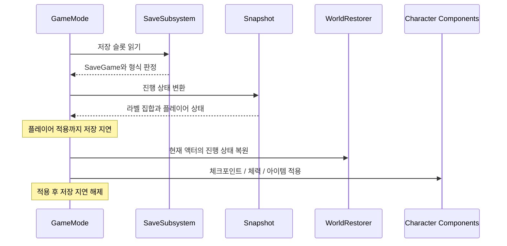

# Aetherfall 핵심 기술과 코드

[프로젝트 개요](ProjectOverview.md) · [전체 소스](SourceIndex.md) · [저장소 README](../../README.md)

이 문서는 현재 구현을 읽는 프로그래머를 위한 설명이다. 코드 블록은 링크에 표시한 연속된 실제 소스 줄에서 발췌했다. 모든 소스 링크는 `2dfcf0cd57cdd7972c35c6d25d4c38c22fcd6ae9` 커밋에 고정되어 있다. 설계 분석, 정적 검사, 실행 검증을 구분하며, 현재 전체 C++ 빌드는 기존 include 오류로 실패한 상태다.

## 1. 전투 판단과 실행의 분리

공격 입력은 현재 행동, 자원, 재사용 시간과 충돌할 수 있다. [ActionGatePolicy](https://github.com/KangWooKim/Aetherfall/blob/2dfcf0cd57cdd7972c35c6d25d4c38c22fcd6ae9/Source/Aetherfall/Private/AetherCombatActionGatePolicy.cpp#L1)는 상태 스냅샷을 받고 허용 여부·실패 문구·예약 여부를 돌려준다. [CombatComponent](https://github.com/KangWooKim/Aetherfall/blob/2dfcf0cd57cdd7972c35c6d25d4c38c22fcd6ae9/Source/Aetherfall/Private/AetherCombatComponent.cpp#L1)는 그 결과를 실행 상태에 반영한다.

약공격 도중의 추가 입력은 새 공격을 즉시 실행하기보다 예약 결과로 표현한다.

```cpp
if (State.bAttacking)
{
    FAetherCombatActionGateResult Result = Blocked(TEXT("Light attack buffered"));
    Result.bShouldQueueLightAttack = true;
    return Result;
}

```

[실제 소스: AetherCombatActionGatePolicy.cpp, 51–57줄](https://github.com/KangWooKim/Aetherfall/blob/2dfcf0cd57cdd7972c35c6d25d4c38c22fcd6ae9/Source/Aetherfall/Private/AetherCombatActionGatePolicy.cpp#L51-L57)

이 결과를 읽을 때 `bCanStartAction`과 `bShouldQueueLightAttack`을 함께 보아야 한다. 시작 거절이 언제나 입력 폐기를 뜻하지 않는다. 후속 공격 실행 시점과 다른 예약 행동의 우선순위는 CombatComponent의 종료 처리에서 결정한다.

| 판단 또는 계획 | 담당 코드 | 실행 시 확인할 부분 |
| --- | --- | --- |
| 행동 허용 | [AetherCombatActionGatePolicy.h](https://github.com/KangWooKim/Aetherfall/blob/2dfcf0cd57cdd7972c35c6d25d4c38c22fcd6ae9/Source/Aetherfall/Public/AetherCombatActionGatePolicy.h#L1) | 사망·방어·피격·패링·다른 공격의 충돌 조건 |
| 상태 전환 | [AetherCombatActionStatePolicy.h](https://github.com/KangWooKim/Aetherfall/blob/2dfcf0cd57cdd7972c35c6d25d4c38c22fcd6ae9/Source/Aetherfall/Public/AetherCombatActionStatePolicy.h#L1) | 시작·종료 시 어떤 플래그를 유지/해제하는가 |
| 타이머 | [AetherCombatActionTimerPolicy.h](https://github.com/KangWooKim/Aetherfall/blob/2dfcf0cd57cdd7972c35c6d25d4c38c22fcd6ae9/Source/Aetherfall/Public/AetherCombatActionTimerPolicy.h#L1) / [AetherCombatActionExecutionPolicy.h](https://github.com/KangWooKim/Aetherfall/blob/2dfcf0cd57cdd7972c35c6d25d4c38c22fcd6ae9/Source/Aetherfall/Public/AetherCombatActionExecutionPolicy.h#L1) | 알림·대체 타이머·행동 종료의 관계 |
| 자원 변경 | [AetherCombatResourcePolicy.h](https://github.com/KangWooKim/Aetherfall/blob/2dfcf0cd57cdd7972c35c6d25d4c38c22fcd6ae9/Source/Aetherfall/Public/AetherCombatResourcePolicy.h#L1) | 자원 계획을 한 적용 경로로 반영하는가 |
| 대상과 피해 | [AetherCombatTargetSelectionPolicy.h](https://github.com/KangWooKim/Aetherfall/blob/2dfcf0cd57cdd7972c35c6d25d4c38c22fcd6ae9/Source/Aetherfall/Public/AetherCombatTargetSelectionPolicy.h#L1) / [AetherCombatDamagePolicy.h](https://github.com/KangWooKim/Aetherfall/blob/2dfcf0cd57cdd7972c35c6d25d4c38c22fcd6ae9/Source/Aetherfall/Public/AetherCombatDamagePolicy.h#L1) | 실제 스윕 후보와 피해 실패 사유를 확인하는가 |

이 구조는 허용 규칙과 월드 조작을 따로 읽기 쉽게 한다. 한 컴포넌트에 모든 분기를 두는 대안은 호출 경로가 짧지만 규칙과 부작용을 함께 검토해야 한다. 현재도 CombatComponent의 실행 조정 책임은 크다. 정책 파일의 개수만으로 설계 품질이나 테스트 가능성이 증명되는 것은 아니다.

기존 자원 정책 정적 검사에서는 예상 함수 7개와 적용부 밖 직접 자원 대입 0을 확인했다. 스태미나 차감 함수 자체가 모든 행동의 시작 가능성을 보장하지는 않으며, 호출자가 행동·잔여 자원을 먼저 검사하는 계약을 함께 읽어야 한다.

## 2. 처형 타격의 중복 해결 방지

처형 타격은 애니메이션 Notify, 대체 타이머, 행동 종료의 보완 경로가 같은 해결 함수에 도달한다. 이때 피해 이벤트가 종료 경로를 다시 부를 수도 있으므로 처리 완료 상태를 외부 호출보다 먼저 확정한다.

```cpp
if (bExecutionImpactResolved)
{
    return;
}

// 피해 콜백이 처형 종료 경로를 다시 호출해도 같은 타격이 반복되지 않도록 먼저 확정한다.
bExecutionImpactResolved = true;
if (UWorld* World = GetWorld())
{
    World->GetTimerManager().ClearTimer(ExecutionImpactTimerHandle);
}

AAetherfallCharacter* Character = OwnerCharacter.Get();
// 현재 대상은 지역 변수에 보관하고 보류 참조는 피해 이벤트 전에 비운다.
AAetherEnemyBase* ExecutionTarget = PendingExecutionTarget.Get();
PendingExecutionTarget.Reset();
```

[실제 소스: AetherCombatComponent.cpp, 1582–1597줄](https://github.com/KangWooKim/Aetherfall/blob/2dfcf0cd57cdd7972c35c6d25d4c38c22fcd6ae9/Source/Aetherfall/Private/AetherCombatComponent.cpp#L1582-L1597)

순서는 **중복 검사 → 완료 플래그 설정 → 타이머 해제 → 대상 지역 참조 확보 → 보류 참조 초기화 → 피해 처리**다. 피해 콜백 전에 `PendingExecutionTarget`을 비우므로 후속 종료 처리가 같은 보류 대상을 다시 해결하지 않도록 한다. 대상이 유효하지 않아 실패해도 이 호출은 해결 완료 상태로 남는다.

실제 피해는 [DamageRequest 구성과 공통 피해 정책 호출](https://github.com/KangWooKim/Aetherfall/blob/2dfcf0cd57cdd7972c35c6d25d4c38c22fcd6ae9/Source/Aetherfall/Private/AetherCombatComponent.cpp#L1606-L1610)에서 실행된다. [대체 타이머 경로](https://github.com/KangWooKim/Aetherfall/blob/2dfcf0cd57cdd7972c35c6d25d4c38c22fcd6ae9/Source/Aetherfall/Private/AetherCombatComponent.cpp#L1623)와 [종료 정리 경로](https://github.com/KangWooKim/Aetherfall/blob/2dfcf0cd57cdd7972c35c6d25d4c38c22fcd6ae9/Source/Aetherfall/Private/AetherCombatComponent.cpp#L1635)를 함께 읽어 플래그가 재설정되는 시점을 확인할 수 있다.

Notify만 사용하는 대안은 경로가 단순하지만 자산 알림에 대한 의존성이 커진다. 현재 구현은 보완 경로를 추가한 만큼 중복 방지와 타이머 정리가 필요하다. 이 보장을 [일반 약공격 Notify](https://github.com/KangWooKim/Aetherfall/blob/2dfcf0cd57cdd7972c35c6d25d4c38c22fcd6ae9/Source/Aetherfall/Private/AetherCombatComponent.cpp#L735)와 [강공격 Notify](https://github.com/KangWooKim/Aetherfall/blob/2dfcf0cd57cdd7972c35c6d25d4c38c22fcd6ae9/Source/Aetherfall/Private/AetherCombatComponent.cpp#L752)에 확대할 수는 없다. 두 경로에는 같은 일회성 플래그가 없으며 실제 몽타주 알림의 중복 발생은 별도 검증 대상이다.

## 3. 저장 스냅샷과 복원 순서

### 저장 데이터와 현재 액터를 분리한다

[SaveGame](https://github.com/KangWooKim/Aetherfall/blob/2dfcf0cd57cdd7972c35c6d25d4c38c22fcd6ae9/Source/Aetherfall/Public/AetherPrototypeSaveGame.h#L1)는 체크포인트, 플레이어 체력·아이템, 진행 라벨 배열과 형식 정보를 보관한다. [Snapshot](https://github.com/KangWooKim/Aetherfall/blob/2dfcf0cd57cdd7972c35c6d25d4c38c22fcd6ae9/Source/Aetherfall/Private/AetherPrototypeCheckpointSnapshot.cpp#L1)은 런타임 라벨 집합과 저장 배열 사이의 변환 및 이전 형식 보정을 담당한다. [SaveSubsystem](https://github.com/KangWooKim/Aetherfall/blob/2dfcf0cd57cdd7972c35c6d25d4c38c22fcd6ae9/Source/Aetherfall/Private/AetherSaveSubsystem.cpp#L1)은 슬롯 읽기·쓰기와 저장 요약을 제공한다.

형식 정책은 미래 버전을 거부하고 이전 버전의 보정 필요성을 알린다. 현재 버전은 2이며, 실제 필드의 복원은 Snapshot의 책임이다.

```cpp
FAetherPrototypeSaveSchemaLoadPlan FAetherPrototypeSaveSchemaPolicy::BuildLoadPlan(const UAetherPrototypeSaveGame& SaveGameObject)
{
    FAetherPrototypeSaveSchemaLoadPlan LoadPlan;
    LoadPlan.SourceSchemaVersion = SaveGameObject.SaveSchemaVersion;
    LoadPlan.TargetSchemaVersion = CurrentSchemaVersion;
    LoadPlan.bIsLegacyUnversioned = LoadPlan.SourceSchemaVersion <= LegacyUnversionedSchemaVersion;
    LoadPlan.bIsFutureVersion = LoadPlan.SourceSchemaVersion > CurrentSchemaVersion;
    LoadPlan.bNeedsMigration = LoadPlan.SourceSchemaVersion < CurrentSchemaVersion;
    LoadPlan.bCanLoad = !LoadPlan.bIsFutureVersion;
    LoadPlan.SummaryMessage = BuildSchemaSummary(LoadPlan);
    return LoadPlan;
}

```

[실제 소스: AetherPrototypeSaveSchemaPolicy.cpp, 19–31줄](https://github.com/KangWooKim/Aetherfall/blob/2dfcf0cd57cdd7972c35c6d25d4c38c22fcd6ae9/Source/Aetherfall/Private/AetherPrototypeSaveSchemaPolicy.cpp#L19-L31)

### 초기값이 기존 저장을 덮어쓰지 않게 한다

GameMode가 저장 상태를 먼저 읽더라도 플레이어 컴포넌트에 체력과 아이템을 적용하는 시점은 뒤따른다. 그 사이 저장 요청이 들어오면 생성 직후 값이 기존 슬롯에 기록될 수 있다. 로드 후 `bDeferPrototypeCheckpointSaveUntilLoadedStateApplied`를 설정하고 적용 완료까지 저장을 지연한다.

```cpp
if (bDeferPrototypeCheckpointSaveUntilLoadedStateApplied)
{
    ShowPrototypeMessage(
        FString::Printf(
            TEXT("Prototype checkpoint save deferred during snapshot restore (%s)"),
            *ActivePrototypeCheckpointLabel.ToString()),
        FColor::Cyan);
    return;
}

```

[실제 소스: AetherGameModeBase.cpp, 978–987줄](https://github.com/KangWooKim/Aetherfall/blob/2dfcf0cd57cdd7972c35c6d25d4c38c22fcd6ae9/Source/Aetherfall/Private/AetherGameModeBase.cpp#L978-L987)

[플레이어 상태 적용 후 저장 지연 해제](https://github.com/KangWooKim/Aetherfall/blob/2dfcf0cd57cdd7972c35c6d25d4c38c22fcd6ae9/Source/Aetherfall/Private/AetherGameModeBase.cpp#L1016-L1046)까지 확인해야 하나의 복원 흐름이 된다. 이 플래그는 초기화 순서를 보호하며 디스크 저장의 원자적 트랜잭션을 보장하는 장치는 아니다.



이 도식은 로드·재시도에서 공통으로 읽을 책임의 순서다. 모든 함수가 한 프레임에 동기적으로 실행된다는 의미는 아니다. 재시도의 적·타이머 정리와 재조우 여부는 [RetryCoordinator](https://github.com/KangWooKim/Aetherfall/blob/2dfcf0cd57cdd7972c35c6d25d4c38c22fcd6ae9/Source/Aetherfall/Private/AetherPrototypeCheckpointRetryCoordinator.cpp#L1)와 GameMode에서 확인한다.

### 라벨로 현재 월드에 상태를 반영한다

액터 주소를 저장해 다음 월드에서 재사용하는 대신 FName 진행 라벨과 집합 포함 여부를 사용한다. WorldRestorer는 액터를 한 번 순회하여 열쇠·보상·기록물·레버·진행 문·열쇠 문·상자·전투 트리거·목표의 9종으로 분류한다.

```cpp
RestorePrototypeActors(
    RestoreActors.KeyPickups,
    [&SnapshotState](const AAetherPrototypeKeyPickup& KeyPickup)
    {
        return SnapshotState.CollectedPrototypeKeyLabels.Contains(KeyPickup.GetKeyLabel());
    });
```

[실제 소스: AetherPrototypeCheckpointWorldRestorer.cpp, 125–130줄](https://github.com/KangWooKim/Aetherfall/blob/2dfcf0cd57cdd7972c35c6d25d4c38c22fcd6ae9/Source/Aetherfall/Private/AetherPrototypeCheckpointWorldRestorer.cpp#L125-L130)

위 발췌는 저장한 열쇠 라벨로 현재 픽업의 복원 상태를 계산하는 부분이다. 실제 적용은 각 액터의 `RestorePrototypeCheckpointState`가 맡는다. 일반 보상 지급이나 연출 재생과 상태 복원 API를 구분하여 복원 중 보상 중복을 피하는 구조다.

전용 액터 등록소는 월드 전체 순회를 줄이는 대안이다. 현재 방식은 등록 생명주기 관리가 단순한 대신 복원 시 월드를 순회하며, [라벨 계약](https://github.com/KangWooKim/Aetherfall/blob/2dfcf0cd57cdd7972c35c6d25d4c38c22fcd6ae9/Source/Aetherfall/Public/AetherPrototypeLabels.h#L1)의 중복·누락을 코드만으로 보장할 수 없다. 실제 맵 배치, 문 상태, 수집 후 재시작, 체크포인트 역행 방지까지 별도로 검증해야 한다.

## 4. 검기 풀링과 반환 계약

### 보관 상한과 동시 발사는 다르다

[ProjectilePoolSubsystem](https://github.com/KangWooKim/Aetherfall/blob/2dfcf0cd57cdd7972c35c6d25d4c38c22fcd6ae9/Source/Aetherfall/Private/AetherProjectilePoolSubsystem.cpp#L1)은 반환된 검기를 우선 재사용하고 없으면 생성한다. 추적 상한은 12개다. 상한을 넘겨 생성한 객체에는 소유 풀을 연결하지 않아 사용 종료 시 일회성 파괴 경로를 따른다.

```cpp
if (AetherSlashProjectilePool.Num() < MaxTrackedAetherSlashProjectiles)
{
    Projectile->SetOwningProjectilePool(this);
    AetherSlashProjectilePool.Add(Projectile);
}
else
{
    Projectile->SetOwningProjectilePool(nullptr);
}

```

[실제 소스: AetherProjectilePoolSubsystem.cpp, 76–85줄](https://github.com/KangWooKim/Aetherfall/blob/2dfcf0cd57cdd7972c35c6d25d4c38c22fcd6ae9/Source/Aetherfall/Private/AetherProjectilePoolSubsystem.cpp#L76-L85)

따라서 12는 동시 발사 허용 수가 아니다. 상한 초과 요청을 거절하는 고정 풀과 달리 초과 발사를 허용하되 반복 스폰 비용은 남는다. 성능을 주장하려면 스폰·파괴 방식과 같은 발사 조건에서 비교해야 한다.

### 반환은 숨기기 이상의 작업이다

```cpp
SetLifeSpan(0.0f);
ResetTransientState();
bFinished = true;
bAvailableForPool = true;

SetActorHiddenInGame(true);
SetActorEnableCollision(false);
SetActorTickEnabled(false);
SetOwner(nullptr);
SetInstigator(nullptr);
```

[실제 소스: AetherSlashProjectile.cpp, 97–106줄](https://github.com/KangWooKim/Aetherfall/blob/2dfcf0cd57cdd7972c35c6d25d4c38c22fcd6ae9/Source/Aetherfall/Private/AetherSlashProjectile.cpp#L97-L106)

`ResetTransientState`는 이전 대상·피해·거리·효과 참조와 적중 배열을 초기화한다. 반환 단계는 소유자와 Instigator를 끊고 틱·충돌·표시를 끈다. 새 발사에는 [InitializeSlash](https://github.com/KangWooKim/Aetherfall/blob/2dfcf0cd57cdd7972c35c6d25d4c38c22fcd6ae9/Source/Aetherfall/Private/AetherSlashProjectile.cpp#L137)로 방향과 수명·피해 설정을 다시 적용한다. 풀링에 상태가 추가되면 [초기화 목록](https://github.com/KangWooKim/Aetherfall/blob/2dfcf0cd57cdd7972c35c6d25d4c38c22fcd6ae9/Source/Aetherfall/Private/AetherSlashProjectile.cpp#L119)도 함께 검토해야 한다.

월드 종료에서는 [풀의 Deinitialize](https://github.com/KangWooKim/Aetherfall/blob/2dfcf0cd57cdd7972c35c6d25d4c38c22fcd6ae9/Source/Aetherfall/Private/AetherProjectilePoolSubsystem.cpp#L14)가 각 검기의 풀 역참조를 먼저 지우고 Destroy를 호출한다. 파괴 과정이 다시 반환 로직에 진입하는 것을 피하기 위한 순서다.

### 현재 검증 명령이 확인하는 것

```cpp
FirstProjectile->InitializeSlash(PlayerPawn, nullptr, SpawnRotation.Vector(), 1.0f, 100.0f, 150.0f, 32.0f);
ProjectilePool->ReleaseAetherSlashProjectile(FirstProjectile);
RecordCheck(FirstProjectile->IsAvailableForPool(), TEXT("released projectile is marked available"));

AAetherSlashProjectile* SecondProjectile = ProjectilePool->AcquireAetherSlashProjectile(PlayerPawn, PlayerPawn, SpawnLocation, SpawnRotation);
RecordCheck(SecondProjectile == FirstProjectile, TEXT("pool reuses released Aether Slash projectile"));
if (SecondProjectile)
{
    ProjectilePool->ReleaseAetherSlashProjectile(SecondProjectile);
}

```

[실제 소스: AetherPoolingRuntimeValidation.cpp, 84–94줄](https://github.com/KangWooKim/Aetherfall/blob/2dfcf0cd57cdd7972c35c6d25d4c38c22fcd6ae9/Source/Aetherfall/Private/Tests/AetherPoolingRuntimeValidation.cpp#L84-L94)

`Aether.Pooling.ValidateRuntime`은 Game/PIE 월드에서 획득 → 반환 → 재획득 후 객체 동일성과 사용 가능 상태를 검사한다. 이 명령은 `!UE_BUILD_SHIPPING`에서 등록된다. 명령 정의를 소스에 포함했지만 현재 빌드 실패 때문에 이번 실행에서는 돌리지 않았다. 같은 포인터가 반환되는지는 프레임 시간·메모리·장시간 발사의 안정성을 증명하지 않는다.

## 5. 적 행동과 공격 슬롯

[EnemyBase](https://github.com/KangWooKim/Aetherfall/blob/2dfcf0cd57cdd7972c35c6d25d4c38c22fcd6ae9/Source/Aetherfall/Private/AetherEnemyBase.cpp#L1)는 C++에서 직접 이동·회전하고, 공격 예고·회복·경직·처형 억제 상태를 확인한다. 공격 패턴은 [패턴 정책](https://github.com/KangWooKim/Aetherfall/blob/2dfcf0cd57cdd7972c35c6d25d4c38c22fcd6ae9/Source/Aetherfall/Private/AetherEnemyAttackPatternPolicy.cpp#L1)에, Aurel의 페이즈 상태는 [보스 페이즈 정책](https://github.com/KangWooKim/Aetherfall/blob/2dfcf0cd57cdd7972c35c6d25d4c38c22fcd6ae9/Source/Aetherfall/Private/AetherAurelBossPhasePolicy.cpp#L1)에 분리되어 있다. Behavior Tree나 NavMesh MoveTo를 사용하는 구현으로 소개하지 않는다.

공격 직전에는 GameMode의 슬롯을 획득해 여러 적의 공격 시작을 조정한다.

```cpp
if (AAetherGameModeBase* GameMode = World->GetAuthGameMode<AAetherGameModeBase>())
{
    if (!GameMode->TryAcquirePrototypeEnemyAttackSlot(this))
    {
        return;
    }
}

```

[실제 소스: AetherEnemyBase.cpp, 496–503줄](https://github.com/KangWooKim/Aetherfall/blob/2dfcf0cd57cdd7972c35c6d25d4c38c22fcd6ae9/Source/Aetherfall/Private/AetherEnemyBase.cpp#L496-L503)

획득·반환·지연 상태의 책임은 [AttackSlotCoordinator](https://github.com/KangWooKim/Aetherfall/blob/2dfcf0cd57cdd7972c35c6d25d4c38c22fcd6ae9/Source/Aetherfall/Private/AetherPrototypeEnemyAttackSlotCoordinator.cpp#L1)에 있다. 적은 죽음·실패·행동 종료 경로에서 슬롯을 반환해야 하며, 패턴을 선택한 것과 실제 공격을 시작한 것은 구분해야 한다.

현재 `TryAttackTarget`은 패턴 선택 후 쿨다운과 슬롯을 검사하므로 대기 중에도 순차 패턴 인덱스가 움직일 여지가 있다. 실제 공격 순서가 항상 고정 순환한다고 주장하지 않는다. [공격 해결](https://github.com/KangWooKim/Aetherfall/blob/2dfcf0cd57cdd7972c35c6d25d4c38c22fcd6ae9/Source/Aetherfall/Private/AetherEnemyBase.cpp#L554)은 평면 거리 중심이며 벽·시야·공격각을 판정하지 않는다. 이는 충돌을 보장하는 근접 무기 궤적 판정과 구별해야 할 현재 한계다.

## 6. 설정 확인을 일시 정지와 분리한다

설정 서비스는 Current/Pending/VideoRevert 스냅샷으로 현재 값·편집 값·복구 값을 분리한다. 해상도나 창 모드 변경 후 확인 기한은 월드 타이머 대신 플랫폼 시간과 코어 틱커를 사용한다. 기본 확인 시간은 15초다.

```cpp
VideoConfirmationDeadlineSeconds = FPlatformTime::Seconds() + VideoConfirmationDurationSeconds;
VideoConfirmationTickerHandle = FTSTicker::GetCoreTicker().AddTicker(
    FTickerDelegate::CreateUObject(this, &UAetherSettingsSubsystem::TickVideoConfirmation),
    0.1f);
OnVideoConfirmationChanged.Broadcast(true);
```

[실제 소스: AetherSettingsSubsystem.cpp, 217–221줄](https://github.com/KangWooKim/Aetherfall/blob/2dfcf0cd57cdd7972c35c6d25d4c38c22fcd6ae9/Source/Aetherfall/Private/AetherSettingsSubsystem.cpp#L217-L221)

[TickVideoConfirmation](https://github.com/KangWooKim/Aetherfall/blob/2dfcf0cd57cdd7972c35c6d25d4c38c22fcd6ae9/Source/Aetherfall/Private/AetherSettingsSubsystem.cpp#L645)에서 기한을 확인한다. 이 구조는 일시 정지 메뉴에서도 확인 시간이 흐르게 하지만, 실제 디스플레이 모드 전환과 포커스·복구 동작은 별도로 실행 검증해야 한다.

현재 [ApplyPendingSettings](https://github.com/KangWooKim/Aetherfall/blob/2dfcf0cd57cdd7972c35c6d25d4c38c22fcd6ae9/Source/Aetherfall/Private/AetherSettingsSubsystem.cpp#L195)는 `SaveCustomSettings()` 실패를 호출자에게 전달하지 않는다. 또한 Pending의 런타임 적용 도중 SoundMix는 Current를 읽고 그 뒤 Current를 갱신하므로 오디오 즉시 반영 순서를 검증할 필요가 있다. 설정 실패 복구가 완성된 상태로 보지는 않는다.

## 7. 연출 종료 이벤트와 상태 정리

컷신 서비스는 활성 상태와 입력·카메라·HUD 잠금을 관리하고 표현 계층에 재생 요청을 보낸다. 종료 이벤트의 수신자가 다음 컷신을 요청할 수 있으므로 종료 상태를 지역 스냅샷으로 보관하고 활성 상태를 먼저 비운다.

```cpp
const FAetherCinematicRuntimeState FinishedState = ActiveState;
RestoreCinematicLocks(ActiveState.Definition);

ActiveState = FAetherCinematicRuntimeState();
ActiveCinematicStartTime = 0.0;

OnCinematicFinished.Broadcast(FinishedState);
OnCinematicFinishedNative.Broadcast(FinishedState);
```

[실제 소스: AetherCinematicDirectorSubsystem.cpp, 203–210줄](https://github.com/KangWooKim/Aetherfall/blob/2dfcf0cd57cdd7972c35c6d25d4c38c22fcd6ae9/Source/Aetherfall/Private/AetherCinematicDirectorSubsystem.cpp#L203-L210)

이 순서는 처형 해결과 마찬가지로 외부 콜백 전에 내부 상태를 정리하는 사례다. 서비스가 LevelSequence 자산을 직접 재생하는 전체 경로를 구현한 것은 아니며, [자동 종료 타이머](https://github.com/KangWooKim/Aetherfall/blob/2dfcf0cd57cdd7972c35c6d25d4c38c22fcd6ae9/Source/Aetherfall/Private/AetherCinematicDirectorSubsystem.cpp#L214)와 실제 Blueprint 표현 계층 연결을 함께 확인해야 한다. 기본 대화 TTS도 시간 기반 Mock이다.

메뉴는 [OpenMap](https://github.com/KangWooKim/Aetherfall/blob/2dfcf0cd57cdd7972c35c6d25d4c38c22fcd6ae9/Source/Aetherfall/Private/AetherMenuFlowSubsystem.cpp#L100)에서 전환 중복을 제어하고 로딩 화면을 요청한다. 현재 새 게임의 저장 삭제 이후 맵 이동 실패를 복구하는 경로는 부족하다. OpenLevel 요청 성공을 맵 로드 완료로 해석하지 않는다.

## 8. 수정 후 검증할 항목

| 변경 유형 | 필요한 확인 |
| --- | --- |
| 전투 상태·Notify | 중복 알림, 타이머와 Notify의 동시 도달, 실패한 대상, 종료 콜백 재진입 |
| 저장 필드·라벨 | 이전/미래 버전, 수집 후 재시도, 생성 직후 저장 요청, 라벨 중복·누락 |
| 검기 상태·풀 | 반환 후 대상·소유자·수명 초기화, 상한 초과, 월드 종료, 반복 발사 |
| 적 행동 | 슬롯 반환 누락, 쿨다운 중 패턴 순서, 벽·공격각·높이 차, 실제 이동 경로 |
| 설정·연출·메뉴 | 일시 정지 중 시간 경과, 실패 복구, 새 요청 재진입, 실제 자산 연결 |

현재 먼저 해결할 빌드 문제는 [SOverlay include 경로](https://github.com/KangWooKim/Aetherfall/blob/2dfcf0cd57cdd7972c35c6d25d4c38c22fcd6ae9/Source/Aetherfall/Private/AetherLoadingScreenSubsystem.cpp#L17)다. 주석 동기화 작업에서는 실행 코드를 바꾸지 않았다. 표의 항목들은 필요한 후속 검증이며 모두 실행해 통과했다는 결과표가 아니다.
