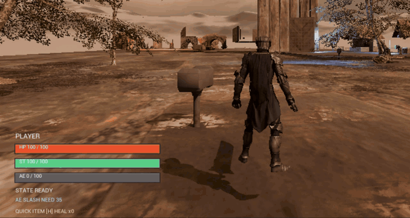
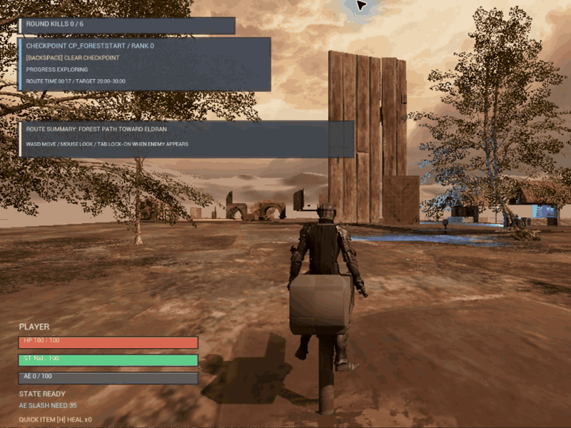
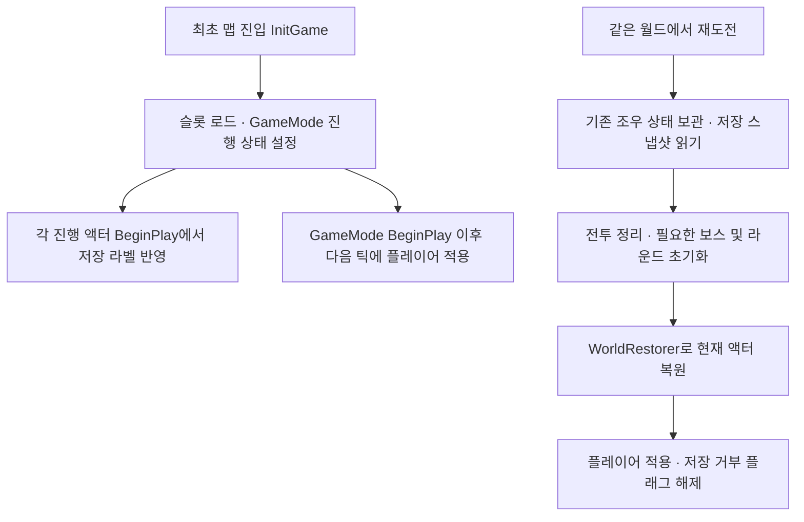
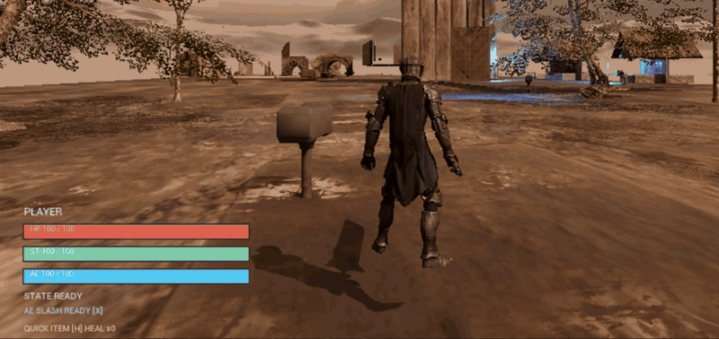
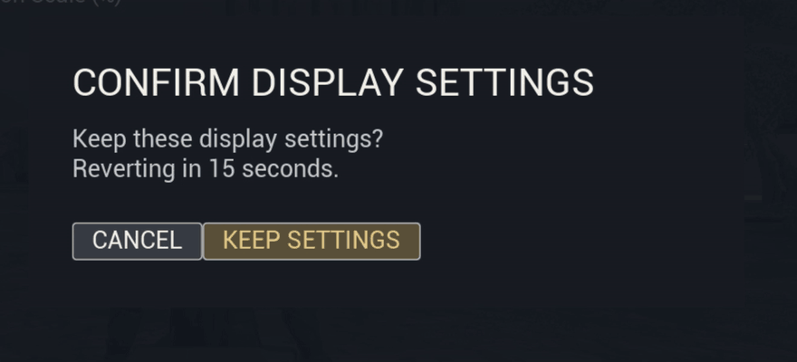

# Aetherfall 핵심 기술과 코드

[프로젝트 개요](ProjectOverview.md) · [전체 소스 색인](SourceIndex.md) · [README](../../README.md)

공개 소스 기준은 `e462c536c195a16b46e526dab94c8d6170275e0c`입니다. 소스 링크는 이 커밋에 고정합니다.

코드 블록은 표시된 연속 구간을 그대로 발췌합니다. 기존 GIF는 전투·복원·설정 동작을 설명하는 시연 화면입니다. 화면만으로 객체 재사용, 내부 처리 시간이나 현재 버전의 실행 성능을 입증하지는 않습니다.

## 1. 전투 판단과 실행의 분리



입력은 [PlayerController의 행동 함수](https://github.com/KangWooKim/Aetherfall/blob/e462c536c195a16b46e526dab94c8d6170275e0c/Source/Aetherfall/Private/AetherPlayerController.cpp#L290)에서 전투 컴포넌트로 전달됩니다. `UAetherCombatComponent`가 행동 플래그, 예약 입력, 자원, 타이머와 몽타주 실행을 소유합니다. 분리된 계산 함수는 이 상태의 스냅샷을 받거나 적용할 값을 돌려줍니다.

[약공격 허용 판단](https://github.com/KangWooKim/Aetherfall/blob/e462c536c195a16b46e526dab94c8d6170275e0c/Source/Aetherfall/Private/AetherCombatActionGatePolicy.cpp#L14)은 사망·방어·피격·처형·강공격·검기·회피를 먼저 검사합니다. 그 조건을 통과한 뒤 이미 약공격 중일 때에만 후속 입력 예약을 반환합니다.

```cpp
	if (State.bAttacking)
	{
		FAetherCombatActionGateResult Result = Blocked(TEXT("Light attack buffered"));
		Result.bShouldQueueLightAttack = true;
		return Result;
	}

```

[실제 코드: AetherCombatActionGatePolicy.cpp 51–57줄](https://github.com/KangWooKim/Aetherfall/blob/e462c536c195a16b46e526dab94c8d6170275e0c/Source/Aetherfall/Private/AetherCombatActionGatePolicy.cpp#L51-L57)

[호출자](https://github.com/KangWooKim/Aetherfall/blob/e462c536c195a16b46e526dab94c8d6170275e0c/Source/Aetherfall/Private/AetherCombatComponent.cpp#L239)가 예약 플래그를 기록하고 반환합니다. [공격 종료](https://github.com/KangWooKim/Aetherfall/blob/e462c536c195a16b46e526dab94c8d6170275e0c/Source/Aetherfall/Private/AetherCombatComponent.cpp#L925)에서는 예약된 처형을 먼저 시도합니다. 약공격 예약은 직전 행동이 약공격이고 다음 콤보 단계가 남은 경우에 처리합니다. 예약은 입력마다 쌓이는 큐가 아니라 종류별 `bool`입니다.

| 구분 | 계산하거나 판단하는 부분 | 실제 적용 위치와 주의점 |
| --- | --- | --- |
| 행동 상태 | [StatePolicy](https://github.com/KangWooKim/Aetherfall/blob/e462c536c195a16b46e526dab94c8d6170275e0c/Source/Aetherfall/Private/AetherCombatActionStatePolicy.cpp#L1)가 모드에 맞는 플래그를 구성합니다. | 컴포넌트가 플래그를 저장합니다. 모든 상태 전이를 한 전이표로 제한하는 구조는 아닙니다. |
| 실행 시점 | [ExecutionPolicy](https://github.com/KangWooKim/Aetherfall/blob/e462c536c195a16b46e526dab94c8d6170275e0c/Source/Aetherfall/Private/AetherCombatActionExecutionPolicy.cpp#L1)가 Notify 대기, 대체 타격과 종료 시간을 계산합니다. | 컴포넌트가 월드 타이머와 몽타주를 실행합니다. |
| 중단 정리 | [TimerPolicy](https://github.com/KangWooKim/Aetherfall/blob/e462c536c195a16b46e526dab94c8d6170275e0c/Source/Aetherfall/Private/AetherCombatActionTimerPolicy.cpp#L1)가 중단 이유별 해제 대상을 구성합니다. | [적용 함수](https://github.com/KangWooKim/Aetherfall/blob/e462c536c195a16b46e526dab94c8d6170275e0c/Source/Aetherfall/Private/AetherCombatComponent.cpp#L155)가 실제 핸들을 해제합니다. |
| 자원 | [ResourcePolicy](https://github.com/KangWooKim/Aetherfall/blob/e462c536c195a16b46e526dab94c8d6170275e0c/Source/Aetherfall/Private/AetherCombatResourcePolicy.cpp#L1)가 변경량을 계산합니다. | [컴포넌트](https://github.com/KangWooKim/Aetherfall/blob/e462c536c195a16b46e526dab94c8d6170275e0c/Source/Aetherfall/Private/AetherCombatComponent.cpp#L215)가 값을 갱신합니다. 스태미나 지출 계산 자체는 부족량을 거부하지 않으므로 시작 함수의 비용 검사가 필요합니다. |
| 타격 | [TracePolicy](https://github.com/KangWooKim/Aetherfall/blob/e462c536c195a16b46e526dab94c8d6170275e0c/Source/Aetherfall/Private/AetherCombatTracePolicy.cpp#L1)가 스윕 기하를 구성하고 [TargetSelectionPolicy](https://github.com/KangWooKim/Aetherfall/blob/e462c536c195a16b46e526dab94c8d6170275e0c/Source/Aetherfall/Private/AetherCombatTargetSelectionPolicy.cpp#L1)가 적중 후보를 고릅니다. | 월드 스윕과 피드백은 호출자가 실행합니다. 우선 대상이 선택되면 추가 대상 배열은 채우지 않습니다. |

`Policy`라는 이름이 순수 계산을 뜻하지는 않습니다. [DamagePolicy](https://github.com/KangWooKim/Aetherfall/blob/e462c536c195a16b46e526dab94c8d6170275e0c/Source/Aetherfall/Private/AetherCombatDamagePolicy.cpp#L1)는 체력 컴포넌트를 찾아 실제로 `ApplyDamage`를 호출합니다. [HealthComponent](https://github.com/KangWooKim/Aetherfall/blob/e462c536c195a16b46e526dab94c8d6170275e0c/Source/Aetherfall/Private/AetherHealthComponent.cpp#L17)는 체력을 변경하고 `OnHealthChanged`, 사망 조건에 해당하면 `OnDeath`를 방송합니다. 체력 변경 이벤트 시점에는 사망 플래그 갱신이 아직 뒤에 있으므로 임의의 재진입까지 원자적으로 처리한다고 설명할 수 없습니다.

행동별 수치는 [CombatActionDataAsset](https://github.com/KangWooKim/Aetherfall/blob/e462c536c195a16b46e526dab94c8d6170275e0c/Source/Aetherfall/Public/AetherCombatActionDataAsset.h#L1)에서 선택적으로 덮어씁니다. [약공격 비용 배열](https://github.com/KangWooKim/Aetherfall/blob/e462c536c195a16b46e526dab94c8d6170275e0c/Source/Aetherfall/Private/AetherCombatComponent.cpp#L1721)이 비어 있으면 컴포넌트 기본 배열로 돌아갑니다. 데이터의 수치 변경과 새로운 행동 종류 추가는 다릅니다. 새 행동에는 입력, 허용 조건, 상태·타이머 정리, 실행과 종료 경로를 함께 연결해야 합니다.

## 2. 처형 타격의 중복 처리 방지

[처형 시작](https://github.com/KangWooKim/Aetherfall/blob/e462c536c195a16b46e526dab94c8d6170275e0c/Source/Aetherfall/Private/AetherCombatComponent.cpp#L269)은 살아 있는 대상의 패리 경직, 체력 비율, 평면 거리를 확인합니다. 락온 대상이 조건을 만족하면 우선 사용하고, 아니면 월드의 적 중 가까운 후보를 고릅니다. 별도의 시야 가림 검사는 없습니다.

시작할 때 대기 대상을 저장하고 `bExecutionImpactResolved`를 `false`로 초기화합니다. Notify, 대체 타이머, 행동 종료의 보완 경로가 같은 [타격 함수](https://github.com/KangWooKim/Aetherfall/blob/e462c536c195a16b46e526dab94c8d6170275e0c/Source/Aetherfall/Private/AetherCombatComponent.cpp#L1580)로 모입니다.

```cpp
	if (bExecutionImpactResolved)
	{
		return;
	}

	// 피해 콜백이 처형 종료 경로를 다시 호출해도 같은 타격이 반복되지 않도록 먼저 확정한다.
	bExecutionImpactResolved = true;
	if (UWorld* World = GetWorld())
	{
		World->GetTimerManager().ClearTimer(ExecutionImpactTimerHandle);
	}

	AAetherfallCharacter* Character = OwnerCharacter.Get();
	// 현재 대상은 지역 변수에 보관하고 보류 참조는 피해 이벤트 전에 비운다.
	AAetherEnemyBase* ExecutionTarget = PendingExecutionTarget.Get();
	PendingExecutionTarget.Reset();
```

[실제 코드: AetherCombatComponent.cpp 1582–1597줄](https://github.com/KangWooKim/Aetherfall/blob/e462c536c195a16b46e526dab94c8d6170275e0c/Source/Aetherfall/Private/AetherCombatComponent.cpp#L1582-L1597)

위 순서로 일반적인 중복 호출을 차단하고 대기 대상을 비운 후 피해를 적용합니다. 대상이나 소유자가 사라진 경우에도 그 시도는 소비되며 자동 재시도하지 않습니다. [정리 함수](https://github.com/KangWooKim/Aetherfall/blob/e462c536c195a16b46e526dab94c8d6170275e0c/Source/Aetherfall/Private/AetherCombatComponent.cpp#L1635)는 핸들과 대상 참조를 해제하고 플래그를 다시 초기화합니다.

보장 범위는 **현재 처형의 대기 타격**입니다. 행동 세대를 구분하는 ID는 없습니다. 이벤트 수신자가 행동을 끝내고 새 처형을 시작하는 경우나 이전 애니메이션의 늦은 Notify까지 모두 구분하는 장치는 아닙니다. 약공격·강공격·검기 Notify에도 이 플래그가 공통 적용되는 것은 아닙니다.

## 3. 저장 스냅샷과 복원 순서



### 저장 데이터와 현재 액터의 분리

`AAetherGameModeBase`가 체크포인트, 완료 조우, 획득물과 해금 라벨을 소유합니다. [스냅샷 작성](https://github.com/KangWooKim/Aetherfall/blob/e462c536c195a16b46e526dab94c8d6170275e0c/Source/Aetherfall/Private/AetherPrototypeCheckpointSnapshot.cpp#L41)이 이를 [SaveGame 데이터](https://github.com/KangWooKim/Aetherfall/blob/e462c536c195a16b46e526dab94c8d6170275e0c/Source/Aetherfall/Public/AetherPrototypeSaveGame.h#L1)로 옮기고 [저장 서비스](https://github.com/KangWooKim/Aetherfall/blob/e462c536c195a16b46e526dab94c8d6170275e0c/Source/Aetherfall/Private/AetherSaveSubsystem.cpp#L9)가 동기 `SaveGameToSlot`을 호출합니다. API의 반환은 저장 호출의 결과이며 디스크 내구성이나 다중 슬롯 트랜잭션을 보장하는 별도 구현은 없습니다.

현재 형식 번호는 **2**, 설명 라벨은 `PrototypeCheckpointV2`입니다. [로드 계획](https://github.com/KangWooKim/Aetherfall/blob/e462c536c195a16b46e526dab94c8d6170275e0c/Source/Aetherfall/Private/AetherPrototypeSaveSchemaPolicy.cpp#L19)은 미래 버전을 거부하고 이전 버전을 보정 대상으로 분류합니다. 실제 판정은 정수 버전으로 수행합니다. 문자열 라벨 비교나 CRC 검사로 파일 전체의 무결성을 보증하는 구조는 아닙니다.

[읽기](https://github.com/KangWooKim/Aetherfall/blob/e462c536c195a16b46e526dab94c8d6170275e0c/Source/Aetherfall/Private/AetherPrototypeCheckpointSnapshot.cpp#L70)는 체크포인트 랭크를 보완하고 마지막 완료 조우를 완료 집합에 합칩니다. 체력·회복 아이템, 진행 집합과 대화 재생 라벨을 옮기지만 모든 액터의 위치·AI·타이머를 직렬화하지는 않습니다. 라벨 집합을 배열로 쓸 때 정렬하지도 않습니다. 저장 대상을 추가하려면 저장 필드, 런타임 상태, 양방향 변환과 해당 액터의 복원 API를 함께 확인해야 합니다.

### 플레이어 복원 전 저장 요청의 처리

[로드](https://github.com/KangWooKim/Aetherfall/blob/e462c536c195a16b46e526dab94c8d6170275e0c/Source/Aetherfall/Private/AetherGameModeBase.cpp#L941)와 [재도전 준비](https://github.com/KangWooKim/Aetherfall/blob/e462c536c195a16b46e526dab94c8d6170275e0c/Source/Aetherfall/Private/AetherGameModeBase.cpp#L1083)는 스냅샷을 읽은 뒤 `bDeferPrototypeCheckpointSaveUntilLoadedStateApplied`를 설정합니다. 저장 함수는 이 플래그가 켜져 있으면 다음과 같이 반환합니다.

[저장 거부 분기](https://github.com/KangWooKim/Aetherfall/blob/e462c536c195a16b46e526dab94c8d6170275e0c/Source/Aetherfall/Private/AetherGameModeBase.cpp#L978-L985)에서 안내 후 반환하며 요청 데이터를 보관하지 않습니다.

즉, 복원 중 저장 요청을 **보관하지 않고 거부합니다**. [플레이어 적용](https://github.com/KangWooKim/Aetherfall/blob/e462c536c195a16b46e526dab94c8d6170275e0c/Source/Aetherfall/Private/AetherGameModeBase.cpp#L1016)이 위치·회전·체력·아이템을 복원한 다음 플래그를 끕니다. 앞서 거부한 요청을 다시 실행하는 단계는 없으며 다음 저장 이벤트가 필요합니다. 플레이어가 없어 조기 반환하면 이 플래그도 유지됩니다.

### 진행 라벨을 이용한 월드 상태 복원

최초 맵 로드와 같은 월드에서의 재도전은 진입 순서가 다릅니다.



[WorldRestorer](https://github.com/KangWooKim/Aetherfall/blob/e462c536c195a16b46e526dab94c8d6170275e0c/Source/Aetherfall/Private/AetherPrototypeCheckpointWorldRestorer.cpp#L1)는 한 번의 액터 순회로 종류별 배열을 구성한 뒤 키 → 보상 → 기록물 → 레버 → 진행 게이트 → 열쇠 게이트 → 상자 → 조우 → 목표 순으로 복원합니다. 각 호출 전 유효성을 확인하며 다음 복원을 위해 액터 목록을 계속 보관하지 않습니다. 초기 맵 진입에서는 이 함수를 일괄 호출하는 대신 액터별 `BeginPlay`가 GameMode 상태를 읽습니다.

레버 복원은 활성 상태만 바꿉니다. 평상시 [레버 작동](https://github.com/KangWooKim/Aetherfall/blob/e462c536c195a16b46e526dab94c8d6170275e0c/Source/Aetherfall/Private/AetherPrototypeLever.cpp#L60)이 여는 대상은 에디터의 `TargetGates`에 지정한 진행 게이트입니다. 복원 때에는 게이트가 자기 라벨과 조건으로 별도 복원됩니다. 같은 의미의 저장 라벨을 여러 독립 대상에 재사용하면 상태를 구분할 수 없으므로 콘텐츠 배치도 이 모델에 맞아야 합니다.

### 이어하기와 새 게임

[저장 요약](https://github.com/KangWooKim/Aetherfall/blob/e462c536c195a16b46e526dab94c8d6170275e0c/Source/Aetherfall/Private/AetherSaveSubsystem.cpp#L37)은 슬롯 존재뿐 아니라 실제 로드·형식 지원·활성 체크포인트를 확인합니다. [이어하기](https://github.com/KangWooKim/Aetherfall/blob/e462c536c195a16b46e526dab94c8d6170275e0c/Source/Aetherfall/Private/AetherMenuFlowSubsystem.cpp#L25)가 검사하는 `bLoadable`은 기존 저장의 **로드 가능 여부**이며 저장 쓰기 권한이 아닙니다.

[새 게임](https://github.com/KangWooKim/Aetherfall/blob/e462c536c195a16b46e526dab94c8d6170275e0c/Source/Aetherfall/Private/AetherMenuFlowSubsystem.cpp#L46)은 기존 슬롯이 있으면 덮어쓰기 확인을 요구합니다. 확인 후 삭제가 성공해야 맵 열기를 요청합니다. 맵 전환이 뒤늦게 실패했을 때 삭제된 슬롯을 자동 복구하는 기능은 없습니다. `Transitioning` 동안의 일반 중복 요청은 거절하고 `PostLoadMap`에서 상태를 해제합니다. `OpenMap`의 성공 반환은 요청 제출을 뜻하며 맵 로드 완료나 플레이 가능 시점을 뜻하지 않습니다.

## 4. 검기 풀링과 반환 처리



### 추적 상한과 초과 요청 처리

[획득 함수](https://github.com/KangWooKim/Aetherfall/blob/e462c536c195a16b46e526dab94c8d6170275e0c/Source/Aetherfall/Private/AetherProjectilePoolSubsystem.cpp#L34)는 사용할 수 있는 검기를 먼저 찾습니다. 없으면 생성하고, 보관 배열이 **12개 미만일 때만** 풀 소유 관계를 설정합니다. 초과 생성물은 풀 밖의 액터로 실행됩니다. 12는 추적·보관 상한이며 동시 활성 수, 월드 전체 검기 수나 누적 생성 수의 상한이 아닙니다.

```cpp
	if (AetherSlashProjectilePool.Num() < MaxTrackedAetherSlashProjectiles)
	{
		Projectile->SetOwningProjectilePool(this);
		AetherSlashProjectilePool.Add(Projectile);
	}
	else
	{
		Projectile->SetOwningProjectilePool(nullptr);
	}

	Projectile->ActivateForPool(Owner, Instigator, SpawnLocation, SpawnRotation);
```

[실제 코드: AetherProjectilePoolSubsystem.cpp 76–86줄](https://github.com/KangWooKim/Aetherfall/blob/e462c536c195a16b46e526dab94c8d6170275e0c/Source/Aetherfall/Private/AetherProjectilePoolSubsystem.cpp#L76-L86)

### 획득·초기화·반환·재획득

[발사 호출자](https://github.com/KangWooKim/Aetherfall/blob/e462c536c195a16b46e526dab94c8d6170275e0c/Source/Aetherfall/Private/AetherCombatComponent.cpp#L1396)는 획득 이후 `InitializeSlash`과 `SetImpactAssets`를 실행합니다. `ActivateForPool`만으로 발사별 피해·속도·방향·효과 설정이 끝나지는 않습니다. 생성에 실패하면 발사 함수가 반환하며 이미 소비한 게이지를 환급하는 경로는 없습니다.

| 단계 | 현재 처리 |
| --- | --- |
| 활성화 | 소유자·인스티게이터·변환을 설정하고 가시성과 Tick을 켭니다. |
| 발사 초기화 | 방향을 정규화하고 이동 거리와 타격 상태를 초기화하며 수명을 설정합니다. |
| 비행 | [Tick](https://github.com/KangWooKim/Aetherfall/blob/e462c536c195a16b46e526dab94c8d6170275e0c/Source/Aetherfall/Private/AetherSlashProjectile.cpp#L59)에서 남은 거리 안으로 이동 구간을 제한하고 Pawn 채널을 스윕합니다. 락온 우선 선택은 유도 비행을 뜻하지 않습니다. |
| 명중·거리 종료·수명 만료 | [종료 함수](https://github.com/KangWooKim/Aetherfall/blob/e462c536c195a16b46e526dab94c8d6170275e0c/Source/Aetherfall/Private/AetherSlashProjectile.cpp#L295)가 완료 플래그를 먼저 설정한 뒤 반환 또는 파괴로 진행합니다. 첫 피해 적용 성공에서 종료하며 관통 투사체가 아닙니다. |
| 풀 반환 | [비활성화](https://github.com/KangWooKim/Aetherfall/blob/e462c536c195a16b46e526dab94c8d6170275e0c/Source/Aetherfall/Private/AetherSlashProjectile.cpp#L95)가 수명·발사 참조·피해 수치·적중 배열을 초기화하고 Tick·표시·충돌을 끕니다. 배열의 `Reset`은 확보 용량을 유지할 수 있습니다. |
| 풀 밖 반환 | 풀의 추적 대상이 아니거나 소유 풀을 얻지 못하면 `Destroy`합니다. |
| 월드 종료 | [풀 해제](https://github.com/KangWooKim/Aetherfall/blob/e462c536c195a16b46e526dab94c8d6170275e0c/Source/Aetherfall/Private/AetherProjectilePoolSubsystem.cpp#L14)가 추적 액터의 풀 참조를 먼저 끊고 파괴한 뒤 배열을 비웁니다. |

현재 조회 API는 추적 수와 사용 가능 수를 제공합니다. 둘의 차이는 **추적 중인 활성 객체 수**를 설명할 수 있지만 풀 밖 객체, 누적 생성·반환 횟수까지 포함하지 않습니다. 재사용 경로는 확인할 수 있어도 할당량·프레임 비용 감소는 별도 계측이 필요합니다. 시각 표현에는 기본 도형 메시와 빛을 사용하므로 최종 아트 비용으로 일반화할 수도 없습니다.

## 5. 적 행동과 공격 슬롯

[적의 Tick](https://github.com/KangWooKim/Aetherfall/blob/e462c536c195a16b46e526dab94c8d6170275e0c/Source/Aetherfall/Private/AetherEnemyBase.cpp#L391)은 대상 갱신 후 예고 중에는 회전만 갱신하고, 회복·피격·패리 경직·처형 억제·페이즈 전환 중에는 추적과 공격 시작을 건너뜁니다. 추적은 플레이어 방향과 주변 적의 분리 방향을 더한 `AddMovementInput`입니다. AIController의 경로 탐색이나 Behavior Tree 실행은 이 경로에 없습니다.

[일반 패턴](https://github.com/KangWooKim/Aetherfall/blob/e462c536c195a16b46e526dab94c8d6170275e0c/Source/Aetherfall/Private/AetherEnemyAttackPatternPolicy.cpp#L18)은 거리와 양수 가중치 조건을 통과한 후보 중 추첨합니다. [Aurel](https://github.com/KangWooKim/Aetherfall/blob/e462c536c195a16b46e526dab94c8d6170275e0c/Source/Aetherfall/Private/AetherAurelBossPhasePolicy.cpp#L129)은 페이즈별 다음 인덱스에서 가능한 패턴을 순환 검색합니다. 페이즈 판단 구조체가 인덱스·일회성 안내 상태를 갖고, 적 액터가 이동 수치·타이머·보상을 적용합니다.

공격 시작은 [GameMode](https://github.com/KangWooKim/Aetherfall/blob/e462c536c195a16b46e526dab94c8d6170275e0c/Source/Aetherfall/Private/AetherGameModeBase.cpp#L698)를 거쳐 [단일 공격 슬롯](https://github.com/KangWooKim/Aetherfall/blob/e462c536c195a16b46e526dab94c8d6170275e0c/Source/Aetherfall/Private/AetherPrototypeEnemyAttackSlotCoordinator.cpp#L14)을 요청합니다. 조정이 켜져 있으면 살아 있는 현재 소유자와 공격 지연 시각을 확인합니다.

```cpp
	if (CurrentTimeSeconds < AttackDelayUntil && CurrentAttackingEnemy.Get() != RequestingEnemy)
	{
		return false;
	}

	if (!CurrentAttackingEnemy.IsValid() || CurrentAttackingEnemy.Get() == RequestingEnemy)
	{
		CurrentAttackingEnemy = RequestingEnemy;
		return true;
	}

	return false;
```

[실제 코드: AetherPrototypeEnemyAttackSlotCoordinator.cpp 31–42줄](https://github.com/KangWooKim/Aetherfall/blob/e462c536c195a16b46e526dab94c8d6170275e0c/Source/Aetherfall/Private/AetherPrototypeEnemyAttackSlotCoordinator.cpp#L31-L42)

획득 후 적은 예고 → 거리 재판정과 플레이어 피격 처리 → 회복으로 진행하고 회복 종료·공격 중단 등에서 슬롯을 반환합니다. 다른 적의 반환 요청은 현재 소유자를 지우지 않습니다. 요청 대기열이나 순번 보장은 없고, 조정이 꺼져 있으면 요청을 통과시킵니다. 주변 적 분리는 각 적이 다른 적을 순회하므로 개체 증가 시 탐색 비용이 늘어날 가능성이 있으나 현재 병목이라는 측정 결과는 없습니다.

## 6. 일시 정지 중 그래픽 설정 확인 시간 관리



[설정 적용](https://github.com/KangWooKim/Aetherfall/blob/e462c536c195a16b46e526dab94c8d6170275e0c/Source/Aetherfall/Private/AetherSettingsSubsystem.cpp#L196)은 해상도 또는 창 모드가 바뀌면 적용 전 설정 묶음을 보관하고 확인 대기를 시작합니다. **15초는 기능 설정값**입니다. 남은 시간은 `FPlatformTime::Seconds()`로 계산하고 [CoreTicker 콜백](https://github.com/KangWooKim/Aetherfall/blob/e462c536c195a16b46e526dab94c8d6170275e0c/Source/Aetherfall/Private/AetherSettingsSubsystem.cpp#L655)이 만료를 확인합니다.

```cpp
bool UAetherSettingsSubsystem::TickVideoConfirmation(float DeltaTime)
{
	if (!bAwaitingVideoConfirmation)
	{
		return false;
	}
	if (FPlatformTime::Seconds() < VideoConfirmationDeadlineSeconds)
	{
		return true;
	}

	VideoConfirmationTickerHandle.Reset();
	RevertVideoSettings();
	return false;
}
```

[실제 코드: AetherSettingsSubsystem.cpp 655–669줄](https://github.com/KangWooKim/Aetherfall/blob/e462c536c195a16b46e526dab94c8d6170275e0c/Source/Aetherfall/Private/AetherSettingsSubsystem.cpp#L655-L669)

월드 일시 정지와 별개로 진행하는 코어 틱을 사용하지만 앱의 틱 자체가 막혀도 정확히 기한 순간에 실행된다는 뜻은 아닙니다. [확인](https://github.com/KangWooKim/Aetherfall/blob/e462c536c195a16b46e526dab94c8d6170275e0c/Source/Aetherfall/Private/AetherSettingsSubsystem.cpp#L278)과 [취소·만료 복구](https://github.com/KangWooKim/Aetherfall/blob/e462c536c195a16b46e526dab94c8d6170275e0c/Source/Aetherfall/Private/AetherSettingsSubsystem.cpp#L296)는 틱커를 해제합니다. 복구 대상은 화면 모드만이 아니라 보관했던 사용자 설정 묶음 전체입니다. 서브시스템 종료에서도 틱커를 정리합니다.

`UGameUserSettings`의 그래픽 값과 별도 Settings SaveGame의 음량·입력·접근성 값은 다른 저장 경로를 사용합니다. 설정 적용 성공 반환만으로 두 저장 경로의 디스크 쓰기 성공을 보증하지 않습니다. 체크포인트 형식 버전과 설정 저장 형식 버전도 서로 다릅니다.

동적으로 생성한 UI SoundClass는 [사운드 믹스 적용 함수](https://github.com/KangWooKim/Aetherfall/blob/e462c536c195a16b46e526dab94c8d6170275e0c/Source/Aetherfall/Private/AetherSettingsSubsystem.cpp#L389-L432)에서 현재 월드의 오디오 장치에 먼저 등록합니다. 월드·믹스·마스터 클래스가 없으면 적용을 반환하고, 오디오 장치가 있으면 등록한 뒤 믹스 활성화와 클래스별 음량 덮어쓰기를 요청합니다. UI 클래스는 설정 서브시스템이 참조하며, 종료할 때 활성 믹스를 해제합니다.

## 7. 연출 종료 이벤트와 상태 정리

[연출 요청](https://github.com/KangWooKim/Aetherfall/blob/e462c536c195a16b46e526dab94c8d6170275e0c/Source/Aetherfall/Private/AetherCinematicDirectorSubsystem.cpp#L79)은 활성 연출이 있거나 정의가 비활성화되어 있으면 거절합니다. 수락하면 상태·입력 잠금·HUD 표시를 적용하고 시작 이벤트와 `OnCinematicPresentationRequested`를 방송합니다. 시퀀스 필드는 소프트 에셋 참조지만 현재 C++에는 실제 Level Sequence 플레이어 생성·재생 연결이 없습니다. 콘텐츠의 별도 연출 수신자가 필요합니다.

[종료](https://github.com/KangWooKim/Aetherfall/blob/e462c536c195a16b46e526dab94c8d6170275e0c/Source/Aetherfall/Private/AetherCinematicDirectorSubsystem.cpp#L112)는 대체 월드 타이머를 해제하고 기록했던 컨트롤러의 잠금을 풀고 활성 상태를 비운 다음 완료 이벤트를 방송합니다.

```cpp
	const FAetherCinematicRuntimeState FinishedState = ActiveState;
	RestoreCinematicLocks(ActiveState.Definition);

	ActiveState = FAetherCinematicRuntimeState();
	ActiveCinematicStartTime = 0.0;

	OnCinematicFinished.Broadcast(FinishedState);
	OnCinematicFinishedNative.Broadcast(FinishedState);
```

[실제 코드: AetherCinematicDirectorSubsystem.cpp 203–210줄](https://github.com/KangWooKim/Aetherfall/blob/e462c536c195a16b46e526dab94c8d6170275e0c/Source/Aetherfall/Private/AetherCinematicDirectorSubsystem.cpp#L203-L210)

종료 콜백은 이전 활성 상태를 정리한 뒤 호출됩니다. 다만 모든 외부 콜백 재진입을 차단하는 세대 토큰은 없고 기존의 임의 입력 잠금 상태를 통째로 저장·복구하지도 않습니다. 새 요청이나 다른 잠금 소유자와 함께 사용할 때 이 경계를 고려해야 합니다.

연출 대체 종료는 **월드 타이머**, 연출 경과 표시와 로딩 화면 상태 시간은 **플랫폼 시간**을 사용합니다. 설정 확인 타이머와 같은 의미가 아닙니다. [로딩 준비 신호](https://github.com/KangWooKim/Aetherfall/blob/e462c536c195a16b46e526dab94c8d6170275e0c/Source/Aetherfall/Private/AetherLoadingScreenSubsystem.cpp#L92)도 호출자가 알린 상태일 뿐 셰이더·모든 에셋·플레이어 복원의 완료를 일괄 판정하지 않습니다.

## 8. 대화와 게임 진행의 연결

[대화 시작](https://github.com/KangWooKim/Aetherfall/blob/e462c536c195a16b46e526dab94c8d6170275e0c/Source/Aetherfall/Private/AetherDialogueComponent.cpp#L133)은 데이터의 트리거 라벨을 찾습니다. 다른 대화가 진행 중이면 중복을 제외한 트리거를 FIFO 배열에 보관합니다. 저장 요청과 달리 여기는 실제 대기열이 있습니다. `bSaveWhenPlayed` 대상은 대화를 시작할 때 재생 라벨에 추가하므로 마지막 문장을 본 사실과 같지 않습니다. 이 라벨이 디스크에 남으려면 이후 체크포인트 저장이 필요합니다.

대화 종료는 다음 대기를 꺼내 다시 시작 조건을 확인합니다. [기본 Mock TTS](https://github.com/KangWooKim/Aetherfall/blob/e462c536c195a16b46e526dab94c8d6170275e0c/Source/Aetherfall/Private/AetherDialogueTtsService.cpp#L1)는 길이 추정과 완료 시각을 위한 카운트다운이며 음성을 합성하지 않습니다. 실제 음성 서비스는 별도 구현·연결 범위입니다.

## 9. 실행 성능의 현재 범위

[현재 소스의 실행 성능 관측](RuntimePerformance.md)은 소스 커밋 `e462c536c195a16b46e526dab94c8d6170275e0c`의 ForestIntro 전투·라운드 재시작을 독립 실행 3회, 실행당 1,800프레임으로 측정합니다. 1280×720·60 FPS 제한에서 계산 FPS는 58.88–59.89이며, 실행별 프레임·스레드·GPU 시간, 메모리, 실제 행동 수와 LoadMap 경계를 함께 제공합니다. 시작 시 엔진 렌더 스레드 경고가 남은 조건의 프레임 페이싱 관측입니다.

[2026-09-09 오전의 과거 실행 관측](HistoricalPerformance.md)은 당시 사본과 반복 오디오 경고·다른 게임 동시 실행 조건을 포함한 6회 자료입니다. 현재 소스의 새 결과와 비교한 개선율은 산출하지 않습니다.

새 측정 구간에서는 검기 발사가 없었습니다. 검기의 누적 생성·반환·할당 비용, 체크포인트 저장·복원 지연, 디스크 쓰기 완료와 실제 조작 가능 시점은 미측정입니다. 기존 GIF는 기능 설명용 시연입니다.
