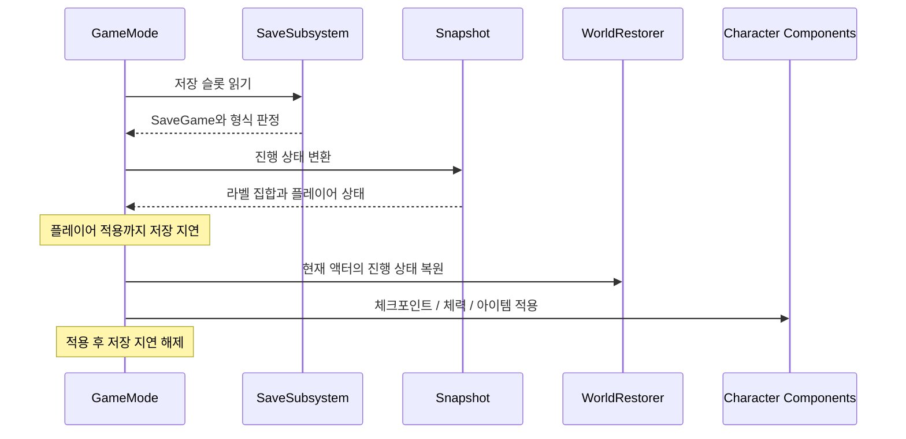

# Aetherfall 핵심 기술과 코드

[프로젝트 개요](ProjectOverview.md) · [전체 소스](SourceIndex.md) · [저장소 README](../../README.md)

코드 블록은 링크에 표시한 연속된 실제 소스 줄에서 발췌했습니다. 모든 소스 링크는 `2dfcf0cd57cdd7972c35c6d25d4c38c22fcd6ae9` 커밋에 고정되어 있습니다.

## 1. 전투 판단과 실행의 분리

공격 입력은 현재 행동, 자원, 재사용 시간과 충돌할 수 있습니다. [ActionGatePolicy](https://github.com/KangWooKim/Aetherfall/blob/2dfcf0cd57cdd7972c35c6d25d4c38c22fcd6ae9/Source/Aetherfall/Private/AetherCombatActionGatePolicy.cpp#L1)는 현재 상태를 담은 스냅샷을 받아 행동 가능 여부·안내 문구·후속 입력 예약 여부를 반환합니다. [CombatComponent](https://github.com/KangWooKim/Aetherfall/blob/2dfcf0cd57cdd7972c35c6d25d4c38c22fcd6ae9/Source/Aetherfall/Private/AetherCombatComponent.cpp#L1)는 그 결과를 실행 상태에 반영합니다.

약공격 도중의 추가 입력은 새 공격을 즉시 실행하기보다 예약 결과로 표현합니다.

```cpp
if (State.bAttacking)
{
    FAetherCombatActionGateResult Result = Blocked(TEXT("Light attack buffered"));
    Result.bShouldQueueLightAttack = true;
    return Result;
}

```

[실제 소스: AetherCombatActionGatePolicy.cpp, 51–57줄](https://github.com/KangWooKim/Aetherfall/blob/2dfcf0cd57cdd7972c35c6d25d4c38c22fcd6ae9/Source/Aetherfall/Private/AetherCombatActionGatePolicy.cpp#L51-L57)

`bCanStartAction`은 즉시 시작 여부를, `bShouldQueueLightAttack`은 후속 약공격 예약 여부를 나타냅니다. CombatComponent의 종료 처리는 예약된 후속 공격의 실행 시점과 다른 예약 행동의 우선순위를 결정합니다.

| 구분 | 담당 코드 | 처리 내용 |
| --- | --- | --- |
| 행동 허용 | [AetherCombatActionGatePolicy.h](https://github.com/KangWooKim/Aetherfall/blob/2dfcf0cd57cdd7972c35c6d25d4c38c22fcd6ae9/Source/Aetherfall/Public/AetherCombatActionGatePolicy.h#L1) | 사망·방어·피격·패링·다른 공격의 충돌 조건 |
| 상태 전환 | [AetherCombatActionStatePolicy.h](https://github.com/KangWooKim/Aetherfall/blob/2dfcf0cd57cdd7972c35c6d25d4c38c22fcd6ae9/Source/Aetherfall/Public/AetherCombatActionStatePolicy.h#L1) | 행동 시작·종료 시 플래그 유지와 해제 |
| 타이머 | [AetherCombatActionTimerPolicy.h](https://github.com/KangWooKim/Aetherfall/blob/2dfcf0cd57cdd7972c35c6d25d4c38c22fcd6ae9/Source/Aetherfall/Public/AetherCombatActionTimerPolicy.h#L1) / [AetherCombatActionExecutionPolicy.h](https://github.com/KangWooKim/Aetherfall/blob/2dfcf0cd57cdd7972c35c6d25d4c38c22fcd6ae9/Source/Aetherfall/Public/AetherCombatActionExecutionPolicy.h#L1) | 알림·대체 타이머·행동 종료의 관계 |
| 자원 변경 | [AetherCombatResourcePolicy.h](https://github.com/KangWooKim/Aetherfall/blob/2dfcf0cd57cdd7972c35c6d25d4c38c22fcd6ae9/Source/Aetherfall/Public/AetherCombatResourcePolicy.h#L1) | 스태미나·게이지 변경값 계산과 공통 적용 함수 |
| 대상과 피해 | [AetherCombatTargetSelectionPolicy.h](https://github.com/KangWooKim/Aetherfall/blob/2dfcf0cd57cdd7972c35c6d25d4c38c22fcd6ae9/Source/Aetherfall/Public/AetherCombatTargetSelectionPolicy.h#L1) / [AetherCombatDamagePolicy.h](https://github.com/KangWooKim/Aetherfall/blob/2dfcf0cd57cdd7972c35c6d25d4c38c22fcd6ae9/Source/Aetherfall/Public/AetherCombatDamagePolicy.h#L1) | 스윕 후보 선택과 피해 적용 결과 |

판정·계산 로직은 행동 가능 여부와 변경할 값을 결과 구조체로 반환합니다. CombatComponent는 이 구조체를 읽어 월드와 액터에 필요한 처리를 수행합니다.

스태미나와 에테르 게이지를 변경할 때는 행동 시작 조건과 잔여량을 확인한 뒤 계산된 값을 적용합니다. ResourcePolicy는 스태미나·에테르 게이지의 변경값을 계산하고, CombatComponent의 공통 적용 함수가 실제 값을 갱신합니다.

## 2. 처형 타격의 중복 처리 방지

처형 타격은 애니메이션 Notify, 대체 타이머, 행동 종료의 보완 경로가 같은 타격 처리 함수를 호출합니다. 이때 피해 이벤트가 종료 경로를 다시 부를 수도 있으므로 처리 완료 상태를 외부 호출보다 먼저 확정합니다.

```cpp
if (bExecutionImpactResolved)
{
    return;
}

// 피해 콜백이 처형 종료 경로를 다시 호출해도 같은 타격이 반복되지 않도록 먼저 확정한다.
bExecutionImpactResolved = true;
if (UWorld* World = GetWorld())
{
    World->GetTimerManager().ClearTimer(ExecutionImpactTimerHandle);
}

AAetherfallCharacter* Character = OwnerCharacter.Get();
// 현재 대상은 지역 변수에 보관하고 보류 참조는 피해 이벤트 전에 비운다.
AAetherEnemyBase* ExecutionTarget = PendingExecutionTarget.Get();
PendingExecutionTarget.Reset();
```

[실제 소스: AetherCombatComponent.cpp, 1582–1597줄](https://github.com/KangWooKim/Aetherfall/blob/2dfcf0cd57cdd7972c35c6d25d4c38c22fcd6ae9/Source/Aetherfall/Private/AetherCombatComponent.cpp#L1582-L1597)

순서는 **중복 검사 → 완료 플래그 설정 → 타이머 해제 → 대상을 지역 변수에 보관 → 대기 중인 대상 참조 초기화 → 피해 처리**입니다. 피해 콜백 전에 `PendingExecutionTarget`을 비우므로 후속 종료 처리가 같은 대상의 타격을 다시 처리하지 않도록 합니다. 대상이 유효하지 않아 실패해도 이 호출은 처리 완료 상태로 남습니다.

실제 피해는 [DamageRequest 구성과 공통 피해 처리 함수 호출](https://github.com/KangWooKim/Aetherfall/blob/2dfcf0cd57cdd7972c35c6d25d4c38c22fcd6ae9/Source/Aetherfall/Private/AetherCombatComponent.cpp#L1606-L1610)에서 실행됩니다. [대체 타이머 경로](https://github.com/KangWooKim/Aetherfall/blob/2dfcf0cd57cdd7972c35c6d25d4c38c22fcd6ae9/Source/Aetherfall/Private/AetherCombatComponent.cpp#L1623)와 [종료 정리 경로](https://github.com/KangWooKim/Aetherfall/blob/2dfcf0cd57cdd7972c35c6d25d4c38c22fcd6ae9/Source/Aetherfall/Private/AetherCombatComponent.cpp#L1635)를 함께 읽어 플래그가 재설정되는 시점을 확인할 수 있습니다.

Notify와 대체 타이머가 공통 타격 처리 함수로 모이고, 완료 플래그와 타이머 해제를 통해 처형 한 회의 처리 상태를 관리합니다.

## 3. 저장 스냅샷과 복원 순서

### 저장 데이터와 현재 액터의 분리

[SaveGame](https://github.com/KangWooKim/Aetherfall/blob/2dfcf0cd57cdd7972c35c6d25d4c38c22fcd6ae9/Source/Aetherfall/Public/AetherPrototypeSaveGame.h#L1)은 체크포인트, 플레이어 체력·아이템, 진행 라벨 배열과 형식 정보를 보관합니다. [Snapshot](https://github.com/KangWooKim/Aetherfall/blob/2dfcf0cd57cdd7972c35c6d25d4c38c22fcd6ae9/Source/Aetherfall/Private/AetherPrototypeCheckpointSnapshot.cpp#L1)은 런타임 라벨 집합과 저장 배열 사이의 변환 및 이전 형식 보정을 담당합니다. [SaveSubsystem](https://github.com/KangWooKim/Aetherfall/blob/2dfcf0cd57cdd7972c35c6d25d4c38c22fcd6ae9/Source/Aetherfall/Private/AetherSaveSubsystem.cpp#L1)은 슬롯 읽기·쓰기와 저장 요약을 제공합니다.

저장 데이터 버전 검사 로직은 지원 버전보다 높은 버전의 로드를 차단하고, 이전 버전 데이터에 변환이 필요한지 판단합니다. 현재 저장 형식은 버전 2이며, 실제 필드 복원은 Snapshot이 담당합니다.

```cpp
FAetherPrototypeSaveSchemaLoadPlan FAetherPrototypeSaveSchemaPolicy::BuildLoadPlan(const UAetherPrototypeSaveGame& SaveGameObject)
{
    FAetherPrototypeSaveSchemaLoadPlan LoadPlan;
    LoadPlan.SourceSchemaVersion = SaveGameObject.SaveSchemaVersion;
    LoadPlan.TargetSchemaVersion = CurrentSchemaVersion;
    LoadPlan.bIsLegacyUnversioned = LoadPlan.SourceSchemaVersion <= LegacyUnversionedSchemaVersion;
    LoadPlan.bIsFutureVersion = LoadPlan.SourceSchemaVersion > CurrentSchemaVersion;
    LoadPlan.bNeedsMigration = LoadPlan.SourceSchemaVersion < CurrentSchemaVersion;
    LoadPlan.bCanLoad = !LoadPlan.bIsFutureVersion;
    LoadPlan.SummaryMessage = BuildSchemaSummary(LoadPlan);
    return LoadPlan;
}

```

[실제 소스: AetherPrototypeSaveSchemaPolicy.cpp, 19–31줄](https://github.com/KangWooKim/Aetherfall/blob/2dfcf0cd57cdd7972c35c6d25d4c38c22fcd6ae9/Source/Aetherfall/Private/AetherPrototypeSaveSchemaPolicy.cpp#L19-L31)

### 플레이어 상태 복원 전 저장 지연

GameMode가 저장 상태를 먼저 읽더라도 플레이어 컴포넌트에 체력과 아이템을 적용하는 시점은 뒤따릅니다. 그 사이 저장 요청이 들어오면 생성 직후 값이 기존 슬롯에 기록될 수 있습니다. 로드 후 `bDeferPrototypeCheckpointSaveUntilLoadedStateApplied`를 설정하고 적용 완료까지 저장을 지연합니다.

```cpp
if (bDeferPrototypeCheckpointSaveUntilLoadedStateApplied)
{
    ShowPrototypeMessage(
        FString::Printf(
            TEXT("Prototype checkpoint save deferred during snapshot restore (%s)"),
            *ActivePrototypeCheckpointLabel.ToString()),
        FColor::Cyan);
    return;
}

```

[실제 소스: AetherGameModeBase.cpp, 978–987줄](https://github.com/KangWooKim/Aetherfall/blob/2dfcf0cd57cdd7972c35c6d25d4c38c22fcd6ae9/Source/Aetherfall/Private/AetherGameModeBase.cpp#L978-L987)

[플레이어 상태 적용 후 저장 지연 해제](https://github.com/KangWooKim/Aetherfall/blob/2dfcf0cd57cdd7972c35c6d25d4c38c22fcd6ae9/Source/Aetherfall/Private/AetherGameModeBase.cpp#L1016-L1046)까지가 하나의 복원 흐름입니다. 이 플래그는 로드한 플레이어 상태가 적용되는 시점까지 저장 요청을 지연합니다.



이 순서도는 저장 데이터 로드와 재시도 과정에서 각 클래스가 수행하는 처리를 보여줍니다. 재시도의 적·타이머 정리와 재조우 처리는 [RetryCoordinator](https://github.com/KangWooKim/Aetherfall/blob/2dfcf0cd57cdd7972c35c6d25d4c38c22fcd6ae9/Source/Aetherfall/Private/AetherPrototypeCheckpointRetryCoordinator.cpp#L1)와 GameMode가 담당합니다.

### 진행 라벨을 이용한 월드 상태 복원

액터 주소를 저장해 다음 월드에서 재사용하는 대신 FName 진행 라벨과 집합 포함 여부를 사용합니다. WorldRestorer는 액터를 한 번 순회하여 열쇠·보상·기록물·레버·진행 문·열쇠 문·상자·전투 트리거·목표의 9종으로 분류합니다.

```cpp
RestorePrototypeActors(
    RestoreActors.KeyPickups,
    [&SnapshotState](const AAetherPrototypeKeyPickup& KeyPickup)
    {
        return SnapshotState.CollectedPrototypeKeyLabels.Contains(KeyPickup.GetKeyLabel());
    });
```

[실제 소스: AetherPrototypeCheckpointWorldRestorer.cpp, 125–130줄](https://github.com/KangWooKim/Aetherfall/blob/2dfcf0cd57cdd7972c35c6d25d4c38c22fcd6ae9/Source/Aetherfall/Private/AetherPrototypeCheckpointWorldRestorer.cpp#L125-L130)

위 발췌는 저장한 열쇠 라벨로 현재 픽업의 복원 상태를 계산하는 부분입니다. 실제 적용은 각 액터의 `RestorePrototypeCheckpointState`가 맡습니다. 일반 보상 지급이나 연출 재생과 상태 복원 API를 구분하여 복원 중 보상 중복을 피하는 구조입니다.

[공통 라벨 정의](https://github.com/KangWooKim/Aetherfall/blob/2dfcf0cd57cdd7972c35c6d25d4c38c22fcd6ae9/Source/Aetherfall/Public/AetherPrototypeLabels.h#L1)에는 수집·개방·완료 상태를 식별하는 공통 이름을 모아두었습니다. WorldRestorer는 종류별 액터 목록에 저장 라벨 집합을 대입해 현재 월드의 상태를 복원합니다.

## 4. 검기 풀링과 반환 처리

### 추적 상한과 초과 요청 처리

[ProjectilePoolSubsystem](https://github.com/KangWooKim/Aetherfall/blob/2dfcf0cd57cdd7972c35c6d25d4c38c22fcd6ae9/Source/Aetherfall/Private/AetherProjectilePoolSubsystem.cpp#L1)은 반환된 검기를 우선 재사용하고 없으면 생성합니다. 추적 상한은 12개입니다. 상한을 넘겨 생성한 객체에는 소유 풀을 연결하지 않아 사용 종료 시 일회성 파괴 경로를 따릅니다.

```cpp
if (AetherSlashProjectilePool.Num() < MaxTrackedAetherSlashProjectiles)
{
    Projectile->SetOwningProjectilePool(this);
    AetherSlashProjectilePool.Add(Projectile);
}
else
{
    Projectile->SetOwningProjectilePool(nullptr);
}

```

[실제 소스: AetherProjectilePoolSubsystem.cpp, 76–85줄](https://github.com/KangWooKim/Aetherfall/blob/2dfcf0cd57cdd7972c35c6d25d4c38c22fcd6ae9/Source/Aetherfall/Private/AetherProjectilePoolSubsystem.cpp#L76-L85)

12개는 풀이 추적하고 보관하는 인스턴스의 상한입니다. 초과 요청은 풀 밖에서 생성한 검기로 처리하고, 해당 검기의 사용이 끝나면 파괴합니다.

### 반환 시 상태와 소유 관계 초기화

```cpp
SetLifeSpan(0.0f);
ResetTransientState();
bFinished = true;
bAvailableForPool = true;

SetActorHiddenInGame(true);
SetActorEnableCollision(false);
SetActorTickEnabled(false);
SetOwner(nullptr);
SetInstigator(nullptr);
```

[실제 소스: AetherSlashProjectile.cpp, 97–106줄](https://github.com/KangWooKim/Aetherfall/blob/2dfcf0cd57cdd7972c35c6d25d4c38c22fcd6ae9/Source/Aetherfall/Private/AetherSlashProjectile.cpp#L97-L106)

`ResetTransientState`는 이전 대상·피해·거리·효과 참조와 적중 배열을 초기화합니다. 반환 단계는 소유자와 Instigator를 끊고 틱·충돌·표시를 끕니다. 새 발사에는 [InitializeSlash](https://github.com/KangWooKim/Aetherfall/blob/2dfcf0cd57cdd7972c35c6d25d4c38c22fcd6ae9/Source/Aetherfall/Private/AetherSlashProjectile.cpp#L137)로 방향과 수명·피해 설정을 다시 적용합니다. 반환 시 지우는 상태는 [초기화 목록](https://github.com/KangWooKim/Aetherfall/blob/2dfcf0cd57cdd7972c35c6d25d4c38c22fcd6ae9/Source/Aetherfall/Private/AetherSlashProjectile.cpp#L119)에 모아둡니다.

월드 종료에서는 [풀의 Deinitialize](https://github.com/KangWooKim/Aetherfall/blob/2dfcf0cd57cdd7972c35c6d25d4c38c22fcd6ae9/Source/Aetherfall/Private/AetherProjectilePoolSubsystem.cpp#L14)가 각 검기가 가진 풀 참조를 먼저 지우고 Destroy를 호출합니다. 파괴 과정이 다시 반환 로직에 진입하는 것을 피하기 위한 순서입니다.

### 획득·반환·재획득의 연결

```cpp
FirstProjectile->InitializeSlash(PlayerPawn, nullptr, SpawnRotation.Vector(), 1.0f, 100.0f, 150.0f, 32.0f);
ProjectilePool->ReleaseAetherSlashProjectile(FirstProjectile);
RecordCheck(FirstProjectile->IsAvailableForPool(), TEXT("released projectile is marked available"));

AAetherSlashProjectile* SecondProjectile = ProjectilePool->AcquireAetherSlashProjectile(PlayerPawn, PlayerPawn, SpawnLocation, SpawnRotation);
RecordCheck(SecondProjectile == FirstProjectile, TEXT("pool reuses released Aether Slash projectile"));
if (SecondProjectile)
{
    ProjectilePool->ReleaseAetherSlashProjectile(SecondProjectile);
}

```

[실제 소스: AetherPoolingRuntimeValidation.cpp, 84–94줄](https://github.com/KangWooKim/Aetherfall/blob/2dfcf0cd57cdd7972c35c6d25d4c38c22fcd6ae9/Source/Aetherfall/Private/Tests/AetherPoolingRuntimeValidation.cpp#L84-L94)

위 코드는 `AcquireAetherSlashProjectile`과 `ReleaseAetherSlashProjectile`을 연결하는 사용 예입니다. 검기를 초기화하고 반환한 뒤 다시 획득하며, `IsAvailableForPool()`과 포인터 비교로 반환 상태와 재사용 객체를 확인하는 코드를 함께 보여줍니다.

## 5. 적 행동과 공격 슬롯

[EnemyBase](https://github.com/KangWooKim/Aetherfall/blob/2dfcf0cd57cdd7972c35c6d25d4c38c22fcd6ae9/Source/Aetherfall/Private/AetherEnemyBase.cpp#L1)는 C++에서 직접 이동·회전하고, 공격 예고·회복·경직·처형 억제 상태를 확인합니다. 공격 패턴은 [공격 패턴 선택 로직](https://github.com/KangWooKim/Aetherfall/blob/2dfcf0cd57cdd7972c35c6d25d4c38c22fcd6ae9/Source/Aetherfall/Private/AetherEnemyAttackPatternPolicy.cpp#L1)에, Aurel의 페이즈 상태는 [보스 페이즈 관리 로직](https://github.com/KangWooKim/Aetherfall/blob/2dfcf0cd57cdd7972c35c6d25d4c38c22fcd6ae9/Source/Aetherfall/Private/AetherAurelBossPhasePolicy.cpp#L1)에 분리되어 있습니다.

공격 직전에는 GameMode의 슬롯을 획득해 여러 적의 공격 시작을 조정합니다.

```cpp
if (AAetherGameModeBase* GameMode = World->GetAuthGameMode<AAetherGameModeBase>())
{
    if (!GameMode->TryAcquirePrototypeEnemyAttackSlot(this))
    {
        return;
    }
}

```

[실제 소스: AetherEnemyBase.cpp, 496–503줄](https://github.com/KangWooKim/Aetherfall/blob/2dfcf0cd57cdd7972c35c6d25d4c38c22fcd6ae9/Source/Aetherfall/Private/AetherEnemyBase.cpp#L496-L503)

슬롯의 획득·반환·지연 상태는 [AttackSlotCoordinator](https://github.com/KangWooKim/Aetherfall/blob/2dfcf0cd57cdd7972c35c6d25d4c38c22fcd6ae9/Source/Aetherfall/Private/AetherPrototypeEnemyAttackSlotCoordinator.cpp#L1)가 관리합니다. `TryAttackTarget`은 패턴 선택 → 쿨다운 확인 → 슬롯 획득 → 공격 예고 순서로 진행하며, 적의 죽음이나 행동 종료 처리에서 슬롯을 반환합니다.

[공격 판정](https://github.com/KangWooKim/Aetherfall/blob/2dfcf0cd57cdd7972c35c6d25d4c38c22fcd6ae9/Source/Aetherfall/Private/AetherEnemyBase.cpp#L554) 단계는 평면 거리로 사거리를 확인하고 플레이어의 피격 처리 API를 호출합니다. 일반 공격 처리는 회복 상태로 이어지고, 패리되면 경직 처리로 연결됩니다.

## 6. 일시 정지 중 그래픽 설정 확인 시간 관리

설정 서비스는 Current/Pending/VideoRevert 스냅샷으로 현재 값·편집 값·복구 값을 분리합니다. 해상도나 창 모드 변경 후 확인 기한은 월드 타이머 대신 플랫폼 시간과 코어 틱커를 사용합니다. 기본 확인 시간은 15초입니다.

```cpp
VideoConfirmationDeadlineSeconds = FPlatformTime::Seconds() + VideoConfirmationDurationSeconds;
VideoConfirmationTickerHandle = FTSTicker::GetCoreTicker().AddTicker(
    FTickerDelegate::CreateUObject(this, &UAetherSettingsSubsystem::TickVideoConfirmation),
    0.1f);
OnVideoConfirmationChanged.Broadcast(true);
```

[실제 소스: AetherSettingsSubsystem.cpp, 217–221줄](https://github.com/KangWooKim/Aetherfall/blob/2dfcf0cd57cdd7972c35c6d25d4c38c22fcd6ae9/Source/Aetherfall/Private/AetherSettingsSubsystem.cpp#L217-L221)

[TickVideoConfirmation](https://github.com/KangWooKim/Aetherfall/blob/2dfcf0cd57cdd7972c35c6d25d4c38c22fcd6ae9/Source/Aetherfall/Private/AetherSettingsSubsystem.cpp#L645)에서 기한을 확인합니다. 월드의 일시 정지와 독립된 시간으로 확인 기한을 계산하고, 시간이 초과하면 보관한 설정으로 복구합니다.

## 7. 연출 종료 이벤트와 상태 정리

컷신 서비스는 활성 상태와 입력·카메라·HUD 잠금을 관리하고 표현 계층에 재생 요청을 보냅니다. 종료 이벤트를 받은 코드가 다음 컷신을 요청할 수 있으므로 종료 상태를 지역 변수에 복사하고 활성 상태를 먼저 비웁니다.

```cpp
const FAetherCinematicRuntimeState FinishedState = ActiveState;
RestoreCinematicLocks(ActiveState.Definition);

ActiveState = FAetherCinematicRuntimeState();
ActiveCinematicStartTime = 0.0;

OnCinematicFinished.Broadcast(FinishedState);
OnCinematicFinishedNative.Broadcast(FinishedState);
```

[실제 소스: AetherCinematicDirectorSubsystem.cpp, 203–210줄](https://github.com/KangWooKim/Aetherfall/blob/2dfcf0cd57cdd7972c35c6d25d4c38c22fcd6ae9/Source/Aetherfall/Private/AetherCinematicDirectorSubsystem.cpp#L203-L210)

이 순서는 외부 콜백 전에 내부 상태를 정리하는 사례입니다. 컷신 요청 이벤트는 표현 계층의 연결 지점이며, 서비스는 [자동 종료 타이머](https://github.com/KangWooKim/Aetherfall/blob/2dfcf0cd57cdd7972c35c6d25d4c38c22fcd6ae9/Source/Aetherfall/Private/AetherCinematicDirectorSubsystem.cpp#L214)와 종료 이벤트를 통해 연출 상태의 생명주기를 관리합니다.

메뉴는 [OpenMap](https://github.com/KangWooKim/Aetherfall/blob/2dfcf0cd57cdd7972c35c6d25d4c38c22fcd6ae9/Source/Aetherfall/Private/AetherMenuFlowSubsystem.cpp#L100)에서 전환 중복을 제어하고 로딩 화면을 요청합니다.
