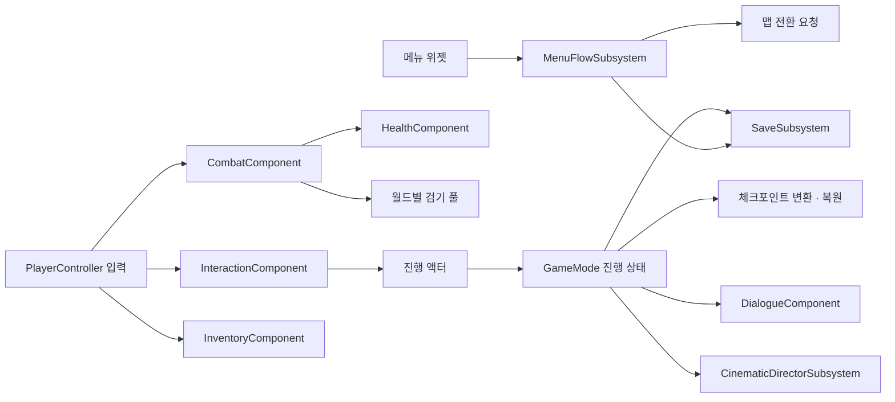

# Aetherfall 프로젝트 개요

[핵심 기술](CoreTechnologies.md) · [소스 색인](SourceIndex.md) · [README](../../README.md)

Aetherfall은 Unreal Engine C++로 전투, 구역 진행, 체크포인트 재도전, 메뉴·설정·대화를 구성한 개인 액션 게임 프로젝트입니다. 여기서는 현재 구현의 역할과 읽기 순서를 설명합니다. 공개 저장소는 소스 검토용이며 완성된 실행 패키지나 전체 콘텐츠 배포본이 아닙니다.

## 플레이 흐름과 상태 소유자

이 그림은 주요 요청 방향을 요약합니다. 세부 구현에는 GameMode가 진행 액터의 이벤트를 방송하거나 복원 함수를 호출하는 반대 방향도 있습니다. 입력 컴포넌트가 직접 저장 파일이나 보스 페이즈를 관리하지는 않습니다.

| 소유 범위 | 실제 역할과 수명 |
| --- | --- |
| [플레이어 캐릭터](https://github.com/KangWooKim/Aetherfall/blob/e462c536c195a16b46e526dab94c8d6170275e0c/Source/Aetherfall/Private/AetherfallCharacter.cpp#L1) | 카메라·무기·전투·체력·락온·상호작용·인벤토리 컴포넌트를 구성하고 이동 방향을 보관합니다. |
| [PlayerController](https://github.com/KangWooKim/Aetherfall/blob/e462c536c195a16b46e526dab94c8d6170275e0c/Source/Aetherfall/Private/AetherPlayerController.cpp#L1) | Enhanced Input 매핑을 생성하고 행동별 차단 조건을 검사한 뒤 컴포넌트 API에 요청을 전달합니다. 일시 정지 메뉴도 이 컨트롤러에 붙은 컴포넌트가 관리합니다. |
| [CombatComponent](https://github.com/KangWooKim/Aetherfall/blob/e462c536c195a16b46e526dab94c8d6170275e0c/Source/Aetherfall/Private/AetherCombatComponent.cpp#L1) | 행동·자원·타이머·몽타주·피드백 실행을 관리합니다. 계산 함수가 분리되어도 실행 책임과 여러 상태는 여기에 남아 있습니다. |
| [GameMode](https://github.com/KangWooKim/Aetherfall/blob/e462c536c195a16b46e526dab94c8d6170275e0c/Source/Aetherfall/Private/AetherGameModeBase.cpp#L1) | 현재 월드의 조우·적 생성·처치 목표·공격 슬롯·진행 라벨·저장/재도전·대화/연출 요청·HUD 안내·배경음을 조율합니다. |
| [월드 서브시스템](https://github.com/KangWooKim/Aetherfall/blob/e462c536c195a16b46e526dab94c8d6170275e0c/Source/Aetherfall/Public/AetherProjectilePoolSubsystem.h#L1) | 현재 월드의 보관 검기를 소유하며 월드 종료에서 정리합니다. |
| [메뉴](https://github.com/KangWooKim/Aetherfall/blob/e462c536c195a16b46e526dab94c8d6170275e0c/Source/Aetherfall/Public/AetherMenuFlowSubsystem.h#L1), [설정](https://github.com/KangWooKim/Aetherfall/blob/e462c536c195a16b46e526dab94c8d6170275e0c/Source/Aetherfall/Public/AetherSettingsSubsystem.h#L1), [연출](https://github.com/KangWooKim/Aetherfall/blob/e462c536c195a16b46e526dab94c8d6170275e0c/Source/Aetherfall/Public/AetherCinematicDirectorSubsystem.h#L1), [로딩](https://github.com/KangWooKim/Aetherfall/blob/e462c536c195a16b46e526dab94c8d6170275e0c/Source/Aetherfall/Public/AetherLoadingScreenSubsystem.h#L1), [저장](https://github.com/KangWooKim/Aetherfall/blob/e462c536c195a16b46e526dab94c8d6170275e0c/Source/Aetherfall/Public/AetherSaveSubsystem.h#L1) | GameInstance 수명의 서비스를 제공합니다. 월드 참조·컨트롤러 잠금·델리게이트·틱커는 개별 서비스의 종료 처리와 함께 읽어야 합니다. |

## 전투와 적 행동

플레이어는 약공격 연계, 강공격, 회피, 가드, 패리, 조건부 처형, 에테르 검기를 사용합니다. 행동 허용·수치 계산과 실제 월드 동작의 관계는 [전투 설명](CoreTechnologies.md#1-전투-판단과-실행의-분리)에 정리합니다. 피해 적용 함수에는 체력과 이벤트를 바꾸는 부수 효과가 있습니다.

적은 `AetherEnemyBase`의 프로필과 공격 패턴을 사용합니다. 일반 적의 가중 선택과 Aurel의 페이즈별 순차 선택을 구분합니다. 적 이동은 방향 추적·분리를 사용하며 장애물 우회 경로는 탐색하지 않습니다. 옵션으로 켜는 공격 슬롯은 동시에 공격을 시작할 소유자를 조정하지만 공정한 차례 배정은 제공하지 않습니다.

## 구역 진행과 저장

[조우 트리거](https://github.com/KangWooKim/Aetherfall/blob/e462c536c195a16b46e526dab94c8d6170275e0c/Source/Aetherfall/Private/AetherPrototypeEncounterTrigger.cpp#L1)가 설정을 전달하면 GameMode가 라운드를 시작합니다. [설정 결합](https://github.com/KangWooKim/Aetherfall/blob/e462c536c195a16b46e526dab94c8d6170275e0c/Source/Aetherfall/Private/AetherPrototypeEncounterConfigPolicy.cpp#L1)은 선택된 덮어쓰기 항목만 적용합니다. 적 생성 수 덮어쓰기는 1–4로 제한하고 빈 아키타입 배열은 기존 값을 유지합니다. 보상 비활성 설정에서는 이전 구역 보상을 비웁니다.

[처치 목표 판단](https://github.com/KangWooKim/Aetherfall/blob/e462c536c195a16b46e526dab94c8d6170275e0c/Source/Aetherfall/Private/AetherPrototypeRoundPolicy.cpp#L1)은 목표 수에 도달해도 살아 있는 적이 남으면 완료하지 않습니다. 목표 달성 안내와 최종 완료를 구분하고, GameMode가 타이머·생성·보상·이벤트·저장을 실제 처리합니다.

진행 상태는 키, 보상, 기록물, 레버, 게이트, 상자, 완료 조우와 목표의 라벨로 표현합니다. 키 게이트는 소지 라벨을 검사하며 키를 소비하지 않습니다. 레버는 에디터에 지정한 진행 게이트를 엽니다. 상자 복원은 열림 상태를 되살리되 보상을 다시 지급하지 않습니다. 모든 상태 변화가 곧바로 파일에 저장되는 것은 아니므로 [저장 경계](CoreTechnologies.md#3-저장-스냅샷과-복원-순서)를 함께 읽어야 합니다.

## 화면과 콘텐츠 연결

[HUD](https://github.com/KangWooKim/Aetherfall/blob/e462c536c195a16b46e526dab94c8d6170275e0c/Source/Aetherfall/Private/AetherHUD.cpp#L1)는 Canvas로 체력·스태미나·게이지·적·진행·대화 안내를 그립니다. [전투 Presenter](https://github.com/KangWooKim/Aetherfall/blob/e462c536c195a16b46e526dab94c8d6170275e0c/Source/Aetherfall/Private/AetherCombatHudPresenter.cpp#L1)와 [시간 Presenter](https://github.com/KangWooKim/Aetherfall/blob/e462c536c195a16b46e526dab94c8d6170275e0c/Source/Aetherfall/Private/AetherPrototypeRoutePacingPresenter.cpp#L1)는 표시할 문자열을 구성합니다. 표시 시간이 끝나도 완료 진행 자체를 되돌리지 않습니다.

[메뉴 위젯](https://github.com/KangWooKim/Aetherfall/blob/e462c536c195a16b46e526dab94c8d6170275e0c/Source/Aetherfall/Private/AetherMainMenuWidget.cpp#L1)은 메인 메뉴와 일시 정지 화면의 구성·설정 입력·덮어쓰기 확인을 담당합니다. Blueprint 위젯 참조를 사용하고 필요한 경로에서 C++ 위젯으로 돌아가는 구현도 있습니다. 콘텐츠의 실제 배치·에셋 연결은 C++ 선언만으로 확정할 수 없습니다.

연출 서비스에는 요청·잠금·종료 알림이 구현되어 있지만 실제 Level Sequence 재생은 별도 연결이 필요합니다. 기본 TTS는 시간 기반 모의 서비스입니다. 에셋 사용·재배포 범위는 개별 라이선스 확인이 필요하며, 공개 소스와 에셋 권리는 별개입니다.

## 코드를 읽거나 확장할 때

| 목적 | 먼저 읽을 위치 | 함께 다룰 경계 |
| --- | --- | --- |
| 공격 수치 조절 | [행동 데이터](https://github.com/KangWooKim/Aetherfall/blob/e462c536c195a16b46e526dab94c8d6170275e0c/Source/Aetherfall/Public/AetherCombatActionDataAsset.h#L1)와 [수치 선택 함수](https://github.com/KangWooKim/Aetherfall/blob/e462c536c195a16b46e526dab94c8d6170275e0c/Source/Aetherfall/Private/AetherCombatComponent.cpp#L1791) | 덮어쓰기 옵션, 비어 있는 배열과 몽타주의 기본값 경로를 확인합니다. |
| 새 행동 추가 | [입력 바인딩](https://github.com/KangWooKim/Aetherfall/blob/e462c536c195a16b46e526dab94c8d6170275e0c/Source/Aetherfall/Private/AetherPlayerController.cpp#L129), [행동 허용 입력](https://github.com/KangWooKim/Aetherfall/blob/e462c536c195a16b46e526dab94c8d6170275e0c/Source/Aetherfall/Public/AetherCombatActionGatePolicy.h#L1), [행동 모드](https://github.com/KangWooKim/Aetherfall/blob/e462c536c195a16b46e526dab94c8d6170275e0c/Source/Aetherfall/Public/AetherCombatActionStatePolicy.h#L1) | 실행·종료·피격/사망/재도전 정리와 Notify 지연 호출까지 연결해야 합니다. |
| 조우 구성 변경 | [조우 DataAsset](https://github.com/KangWooKim/Aetherfall/blob/e462c536c195a16b46e526dab94c8d6170275e0c/Source/Aetherfall/Public/AetherPrototypeEncounterDataAsset.h#L1), [트리거](https://github.com/KangWooKim/Aetherfall/blob/e462c536c195a16b46e526dab94c8d6170275e0c/Source/Aetherfall/Private/AetherPrototypeEncounterTrigger.cpp#L1) | 실제 레벨 참조와 GameMode 런타임 설정의 우선순위를 확인합니다. |
| 저장 대상 추가 | [저장 필드](https://github.com/KangWooKim/Aetherfall/blob/e462c536c195a16b46e526dab94c8d6170275e0c/Source/Aetherfall/Public/AetherPrototypeSaveGame.h#L1), [변환](https://github.com/KangWooKim/Aetherfall/blob/e462c536c195a16b46e526dab94c8d6170275e0c/Source/Aetherfall/Private/AetherPrototypeCheckpointSnapshot.cpp#L1), [월드 적용](https://github.com/KangWooKim/Aetherfall/blob/e462c536c195a16b46e526dab94c8d6170275e0c/Source/Aetherfall/Private/AetherPrototypeCheckpointWorldRestorer.cpp#L1) | 형식 이전 버전, 라벨 중복, 최초 진입과 같은 월드 재도전의 차이를 고려합니다. |
| 실제 대사 음성·컷신 연결 | [TTS 서비스 API](https://github.com/KangWooKim/Aetherfall/blob/e462c536c195a16b46e526dab94c8d6170275e0c/Source/Aetherfall/Public/AetherDialogueTtsService.h#L1), [연출 이벤트](https://github.com/KangWooKim/Aetherfall/blob/e462c536c195a16b46e526dab94c8d6170275e0c/Source/Aetherfall/Public/AetherCinematicDirectorSubsystem.h#L1) | 모의 완료와 실제 재생 완료, 스킵·해제 시점을 구분합니다. |

## 실행 범위

이 저장소만으로 Unreal 프로젝트를 열거나 패키징할 수 없습니다. 원본의 .uproject, Config, Content와 해당 에셋 권한·참조 구성이 필요합니다. 프레임·스레드·GPU 시간, 메모리와 엔진 LoadMap 시간은 [실행 성능](CoreTechnologies.md#9-실행-성능의-현재-범위)에 정리합니다. 체크포인트 저장·복원 지연과 실제 조작 가능 시점은 미측정입니다.
