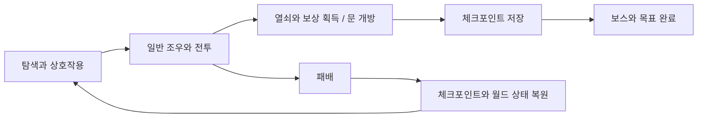
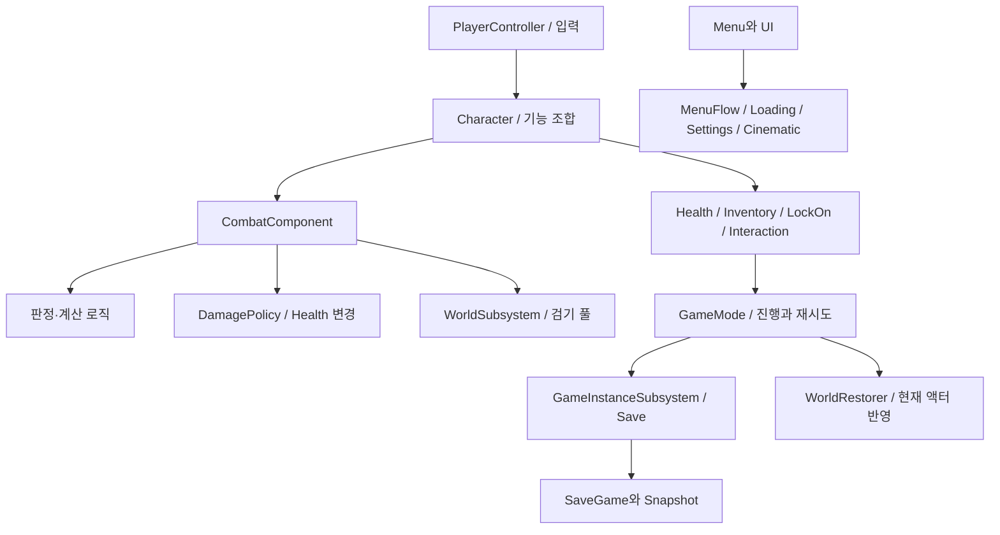

# Aetherfall 프로젝트 개요

[저장소 README](../../README.md) · [핵심 기술](CoreTechnologies.md) · [전체 소스](SourceIndex.md)

## 범위

Aetherfall은 몰락한 왕국을 탐험하며 근접 전투와 검기, 상호작용, 체크포인트 진행을 연결하는 3인칭 액션 RPG 프로토타입입니다. 20~30분 분량의 버티컬 슬라이스를 목표로 합니다. 이 문서는 게임 흐름과 계층별 역할, 주요 시스템의 연결을 설명합니다.

개발자와 Codex가 소스코드를 공동 작성한 개인 프로젝트입니다.

## 게임 흐름



흐름의 조정자는 [AetherGameModeBase](https://github.com/KangWooKim/Aetherfall/blob/2dfcf0cd57cdd7972c35c6d25d4c38c22fcd6ae9/Source/Aetherfall/Private/AetherGameModeBase.cpp#L1)입니다. 진행 상태는 수집·개방·완료 라벨 집합과 체크포인트 상태로 보관합니다. 상호작용 액터는 자신의 기능을 실행한 후 GameMode의 진행 API에 결과를 알립니다. 저장은 체크포인트·조우 완료·목표 완료 등 명시적인 시점에서 이루어집니다.

## 객체 생명주기와 역할

| 계층 | 주요 코드 | 역할과 연결 |
| --- | --- | --- |
| 입력 | [PlayerController](https://github.com/KangWooKim/Aetherfall/blob/2dfcf0cd57cdd7972c35c6d25d4c38c22fcd6ae9/Source/Aetherfall/Private/AetherPlayerController.cpp#L1) | Enhanced Input 매핑·바인딩, Character의 기능 API 호출, UI 입력 제어 |
| 플레이어 구성 | [Character](https://github.com/KangWooKim/Aetherfall/blob/2dfcf0cd57cdd7972c35c6d25d4c38c22fcd6ae9/Source/Aetherfall/Private/AetherfallCharacter.cpp#L1) | 이동·카메라·무기 부착과 기능 컴포넌트의 조합 |
| 기능 | [Combat](https://github.com/KangWooKim/Aetherfall/blob/2dfcf0cd57cdd7972c35c6d25d4c38c22fcd6ae9/Source/Aetherfall/Public/AetherCombatComponent.h#L1) / [Health](https://github.com/KangWooKim/Aetherfall/blob/2dfcf0cd57cdd7972c35c6d25d4c38c22fcd6ae9/Source/Aetherfall/Public/AetherHealthComponent.h#L1) / [Inventory](https://github.com/KangWooKim/Aetherfall/blob/2dfcf0cd57cdd7972c35c6d25d4c38c22fcd6ae9/Source/Aetherfall/Public/AetherInventoryComponent.h#L1) | 행동 실행·피해 처리·회복 아이템과 이벤트 |
| 후보 탐색 | [LockOn](https://github.com/KangWooKim/Aetherfall/blob/2dfcf0cd57cdd7972c35c6d25d4c38c22fcd6ae9/Source/Aetherfall/Public/AetherLockOnComponent.h#L1) / [Interaction](https://github.com/KangWooKim/Aetherfall/blob/2dfcf0cd57cdd7972c35c6d25d4c38c22fcd6ae9/Source/Aetherfall/Public/AetherInteractionComponent.h#L1) | 락온 후보와 근처 상호작용 대상의 선택 |
| 월드 진행 | [GameMode](https://github.com/KangWooKim/Aetherfall/blob/2dfcf0cd57cdd7972c35c6d25d4c38c22fcd6ae9/Source/Aetherfall/Public/AetherGameModeBase.h#L1) | 조우, 공격 슬롯, 라벨 집합, 저장 시점, 패배 재시도 |
| 게임 인스턴스 서비스 | [Save](https://github.com/KangWooKim/Aetherfall/blob/2dfcf0cd57cdd7972c35c6d25d4c38c22fcd6ae9/Source/Aetherfall/Public/AetherSaveSubsystem.h#L1) / [MenuFlow](https://github.com/KangWooKim/Aetherfall/blob/2dfcf0cd57cdd7972c35c6d25d4c38c22fcd6ae9/Source/Aetherfall/Public/AetherMenuFlowSubsystem.h#L1) / [Settings](https://github.com/KangWooKim/Aetherfall/blob/2dfcf0cd57cdd7972c35c6d25d4c38c22fcd6ae9/Source/Aetherfall/Public/AetherSettingsSubsystem.h#L1) | 저장 슬롯·메뉴 전환·설정 편집 상태 |
| 화면과 연출 | [Loading](https://github.com/KangWooKim/Aetherfall/blob/2dfcf0cd57cdd7972c35c6d25d4c38c22fcd6ae9/Source/Aetherfall/Public/AetherLoadingScreenSubsystem.h#L1) / [Cinematic](https://github.com/KangWooKim/Aetherfall/blob/2dfcf0cd57cdd7972c35c6d25d4c38c22fcd6ae9/Source/Aetherfall/Public/AetherCinematicDirectorSubsystem.h#L1) | 로딩 표시 상태, 컷신 요청과 입력 잠금·해제 |
| 월드 단위 서비스 | [ProjectilePool](https://github.com/KangWooKim/Aetherfall/blob/2dfcf0cd57cdd7972c35c6d25d4c38c22fcd6ae9/Source/Aetherfall/Public/AetherProjectilePoolSubsystem.h#L1) | 검기 획득·반환과 월드 종료 정리 |
| 적 | [EnemyBase](https://github.com/KangWooKim/Aetherfall/blob/2dfcf0cd57cdd7972c35c6d25d4c38c22fcd6ae9/Source/Aetherfall/Public/AetherEnemyBase.h#L1) | 추적·공격 예고·회복·경직, 패턴 선택과 보스 페이즈 |
| 표현 | [HUD](https://github.com/KangWooKim/Aetherfall/blob/2dfcf0cd57cdd7972c35c6d25d4c38c22fcd6ae9/Source/Aetherfall/Public/AetherHUD.h#L1) / [MainMenuWidget](https://github.com/KangWooKim/Aetherfall/blob/2dfcf0cd57cdd7972c35c6d25d4c38c22fcd6ae9/Source/Aetherfall/Public/AetherMainMenuWidget.h#L1) | Canvas HUD, UMG 메뉴 구성과 사용자 요청 전달 |



GameInstanceSubsystem은 맵을 전환하는 동안 유지할 서비스 상태를, WorldSubsystem은 현재 월드에 속한 풀을 담당합니다. Character의 컴포넌트는 소유 액터와 함께 구성됩니다. GameMode는 현재 월드의 조우·진행·저장 시점과 재시도를 조정합니다.

### Character의 기능 조합

```cpp
CombatComponent = CreateDefaultSubobject<UAetherCombatComponent>(TEXT("CombatComponent"));
HealthComponent = CreateDefaultSubobject<UAetherHealthComponent>(TEXT("HealthComponent"));
InventoryComponent = CreateDefaultSubobject<UAetherInventoryComponent>(TEXT("InventoryComponent"));
LockOnComponent = CreateDefaultSubobject<UAetherLockOnComponent>(TEXT("LockOnComponent"));
InteractionComponent = CreateDefaultSubobject<UAetherInteractionComponent>(TEXT("InteractionComponent"));
```

[실제 소스: AetherfallCharacter.cpp, 56–60줄](https://github.com/KangWooKim/Aetherfall/blob/2dfcf0cd57cdd7972c35c6d25d4c38c22fcd6ae9/Source/Aetherfall/Private/AetherfallCharacter.cpp#L56-L60)

Character가 개별 기능을 기본 서브오브젝트로 생성합니다. 입력 바인딩은 Controller가 담당하고, Character와 각 Component의 API를 호출해 기능을 실행합니다. Combat은 소유 Character와 Health 등 전투에 필요한 상태를 참조합니다.

## 전투의 처리 경로

`입력 → 행동 가능 여부 검사 → 스태미나·게이지/타이머/상태 변경값 계산 → 몽타주·스윕 실행 → 대상 선택 → 피해 적용 → 피드백`

ActionGate·ActionState·ActionTimer·ActionExecution·ActionTuning·Resource 클래스는 현재 조건에서 행동 가능 여부와 적용할 변경값을 계산합니다. CombatComponent는 결과를 읽고 실제 상태·타이머·애니메이션을 조정합니다. TracePolicy는 스윕 파라미터를 계산하고, DamagePolicy는 대상과 체력 상태를 확인해 피해를 적용합니다.

주요 처리 방식은 [처형 타격의 중복 처리 방지](CoreTechnologies.md#2-처형-타격의-중복-처리-방지), [저장 데이터와 월드 복원](CoreTechnologies.md#3-저장-스냅샷과-복원-순서), [검기 풀의 수명](CoreTechnologies.md#4-검기-풀링과-반환-처리)에서 구체적으로 설명합니다.

## 데이터 설정과 Blueprint 연동

| 조정 지점 | 역할 | 데이터 적용 방식 |
| --- | --- | --- |
| [AetherCombatActionDataAsset.h](https://github.com/KangWooKim/Aetherfall/blob/2dfcf0cd57cdd7972c35c6d25d4c38c22fcd6ae9/Source/Aetherfall/Public/AetherCombatActionDataAsset.h#L1) | 공격 수치·몽타주·효과의 선택적 오버라이드 | 오버라이드 플래그에 따라 값을 선택하고 참조가 비어 있으면 기본값을 적용 |
| [AetherPrototypeEncounterDataAsset.h](https://github.com/KangWooKim/Aetherfall/blob/2dfcf0cd57cdd7972c35c6d25d4c38c22fcd6ae9/Source/Aetherfall/Public/AetherPrototypeEncounterDataAsset.h#L1) | 조우의 적 구성·보상 등 설정 | 라벨로 조우 설정과 월드 액터를 연결 |
| [AetherDialogueDataAsset.h](https://github.com/KangWooKim/Aetherfall/blob/2dfcf0cd57cdd7972c35c6d25d4c38c22fcd6ae9/Source/Aetherfall/Public/AetherDialogueDataAsset.h#L1) | 대화 줄과 재생 설정 | 경과 시간으로 완료를 알리는 모의 TTS로 대화 재생 시간을 구성 |
| UPROPERTY / UFUNCTION | 디자이너 값과 Blueprint에서 접근하는 API | 리플렉션 메타데이터로 편집 가능한 값과 호출 API를 노출 |
| 컷신 이벤트 | 시퀀스 재생 요청과 입력/HUD 잠금 | C++ 서비스가 상태·잠금을 관리하고 요청 이벤트로 표현 계층을 연결 |

## 기술 환경과 프로젝트 구성

Source는 게임 모듈과 Game/Editor Target으로 구성됩니다. 개발 환경은 UE 5.4 / Visual Studio 2022 MSVC 14.34 / Windows SDK 10.0.22000입니다. 실행 프로젝트의 `.uproject`, Config, 맵·Blueprint·애니메이션·외부 에셋은 별도로 관리합니다.

## 외부 자산과 작성 범위

핵심 게임플레이 C++ 코드는 개발자와 Codex가 공동 작성했습니다. 외부 아트·애니메이션·VFX·음향은 Marketplace/Fab 자산을 활용했습니다. 자산 사용 방침에는 Dark Knight Male/Female, Great Sword, InfinityBladeEffects, FantasyOrchestral이 기록되어 있습니다.
