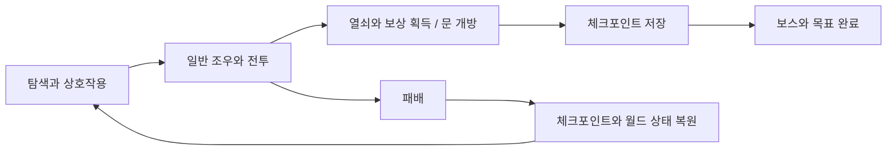
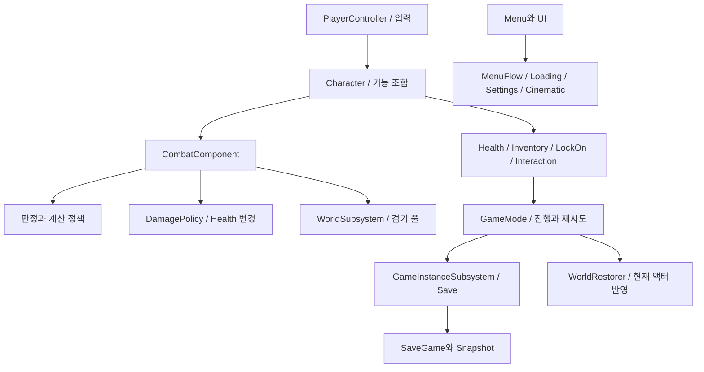

# Aetherfall 프로젝트 개요

[저장소 README](../../README.md) · [핵심 기술](CoreTechnologies.md) · [전체 소스](SourceIndex.md)

## 범위와 읽는 관점

Aetherfall은 몰락한 왕국을 탐험하며 근접 전투와 검기, 상호작용, 체크포인트 진행을 연결하는 3인칭 액션 RPG 프로토타입이다. 20~30분 분량의 버티컬 슬라이스는 설계 목표이며 측정한 완주 시간이 아니다. 이 문서는 2026-09-07 코드 상태를 분석한다. 기능이 코드에 있다는 사실과 실제 레벨에서 검증한 결과를 구분한다.

개인 프로젝트이며 개발자와 Codex가 코드를 공동 작성했다. 검증 등의 작업은 Codex에 맡겼다. 문서의 설계 설명은 현재 코드의 분석이며, 기록이 없는 개인 문제 해결 경험을 재구성하지 않는다.

## 게임 흐름



흐름의 조정자는 [AetherGameModeBase](https://github.com/KangWooKim/Aetherfall/blob/2dfcf0cd57cdd7972c35c6d25d4c38c22fcd6ae9/Source/Aetherfall/Private/AetherGameModeBase.cpp#L1)다. 진행 상태는 수집·개방·완료 라벨 집합과 체크포인트 상태로 보관한다. 상호작용 액터는 자신의 기능을 실행한 후 GameMode의 진행 API에 결과를 알린다. 모든 수집 시점에 디스크 저장을 하는 구조는 아니며, 저장은 체크포인트·조우 완료·목표 완료 등 명시적인 시점에서 이루어진다.

## 수명과 책임

| 계층 | 주요 코드 | 책임과 연결 |
| --- | --- | --- |
| 입력 | [PlayerController](https://github.com/KangWooKim/Aetherfall/blob/2dfcf0cd57cdd7972c35c6d25d4c38c22fcd6ae9/Source/Aetherfall/Private/AetherPlayerController.cpp#L1) | Enhanced Input 매핑·바인딩, Character의 기능 API 호출, UI 입력 제어 |
| 플레이어 구성 | [Character](https://github.com/KangWooKim/Aetherfall/blob/2dfcf0cd57cdd7972c35c6d25d4c38c22fcd6ae9/Source/Aetherfall/Private/AetherfallCharacter.cpp#L1) | 이동·카메라·무기 부착과 기능 컴포넌트의 조합 |
| 기능 | [Combat](https://github.com/KangWooKim/Aetherfall/blob/2dfcf0cd57cdd7972c35c6d25d4c38c22fcd6ae9/Source/Aetherfall/Public/AetherCombatComponent.h#L1) / [Health](https://github.com/KangWooKim/Aetherfall/blob/2dfcf0cd57cdd7972c35c6d25d4c38c22fcd6ae9/Source/Aetherfall/Public/AetherHealthComponent.h#L1) / [Inventory](https://github.com/KangWooKim/Aetherfall/blob/2dfcf0cd57cdd7972c35c6d25d4c38c22fcd6ae9/Source/Aetherfall/Public/AetherInventoryComponent.h#L1) | 행동 실행·피해 처리·회복 아이템과 이벤트 |
| 후보 탐색 | [LockOn](https://github.com/KangWooKim/Aetherfall/blob/2dfcf0cd57cdd7972c35c6d25d4c38c22fcd6ae9/Source/Aetherfall/Public/AetherLockOnComponent.h#L1) / [Interaction](https://github.com/KangWooKim/Aetherfall/blob/2dfcf0cd57cdd7972c35c6d25d4c38c22fcd6ae9/Source/Aetherfall/Public/AetherInteractionComponent.h#L1) | 락온 후보와 근처 상호작용 대상의 선택 |
| 월드 진행 | [GameMode](https://github.com/KangWooKim/Aetherfall/blob/2dfcf0cd57cdd7972c35c6d25d4c38c22fcd6ae9/Source/Aetherfall/Public/AetherGameModeBase.h#L1) | 조우, 공격 슬롯, 라벨 집합, 저장 시점, 패배 재시도 |
| 게임 인스턴스 서비스 | [Save](https://github.com/KangWooKim/Aetherfall/blob/2dfcf0cd57cdd7972c35c6d25d4c38c22fcd6ae9/Source/Aetherfall/Public/AetherSaveSubsystem.h#L1) / [MenuFlow](https://github.com/KangWooKim/Aetherfall/blob/2dfcf0cd57cdd7972c35c6d25d4c38c22fcd6ae9/Source/Aetherfall/Public/AetherMenuFlowSubsystem.h#L1) / [Settings](https://github.com/KangWooKim/Aetherfall/blob/2dfcf0cd57cdd7972c35c6d25d4c38c22fcd6ae9/Source/Aetherfall/Public/AetherSettingsSubsystem.h#L1) | 저장 슬롯·메뉴 전환·설정 편집 상태 |
| 화면과 연출 | [Loading](https://github.com/KangWooKim/Aetherfall/blob/2dfcf0cd57cdd7972c35c6d25d4c38c22fcd6ae9/Source/Aetherfall/Public/AetherLoadingScreenSubsystem.h#L1) / [Cinematic](https://github.com/KangWooKim/Aetherfall/blob/2dfcf0cd57cdd7972c35c6d25d4c38c22fcd6ae9/Source/Aetherfall/Public/AetherCinematicDirectorSubsystem.h#L1) | 로딩 표시 상태, 컷신 요청과 입력 잠금·해제 |
| 월드 수명 서비스 | [ProjectilePool](https://github.com/KangWooKim/Aetherfall/blob/2dfcf0cd57cdd7972c35c6d25d4c38c22fcd6ae9/Source/Aetherfall/Public/AetherProjectilePoolSubsystem.h#L1) | 검기 획득·반환과 월드 종료 정리 |
| 적 | [EnemyBase](https://github.com/KangWooKim/Aetherfall/blob/2dfcf0cd57cdd7972c35c6d25d4c38c22fcd6ae9/Source/Aetherfall/Public/AetherEnemyBase.h#L1) | 추적·공격 예고·회복·경직, 패턴 선택과 보스 페이즈 |
| 표현 | [HUD](https://github.com/KangWooKim/Aetherfall/blob/2dfcf0cd57cdd7972c35c6d25d4c38c22fcd6ae9/Source/Aetherfall/Public/AetherHUD.h#L1) / [MainMenuWidget](https://github.com/KangWooKim/Aetherfall/blob/2dfcf0cd57cdd7972c35c6d25d4c38c22fcd6ae9/Source/Aetherfall/Public/AetherMainMenuWidget.h#L1) | Canvas HUD, UMG 메뉴 구성과 사용자 요청 전달 |



GameInstanceSubsystem은 맵을 전환하는 동안 유지할 서비스 상태를, WorldSubsystem은 현재 월드에 속한 풀을 담당한다. Character의 컴포넌트는 소유 액터와 함께 구성된다. GameMode에는 여전히 큰 실행 조정 책임이 남아 있어 모든 책임이 완전히 분리되었다고 보지는 않는다.

### Character의 기능 조합

```cpp
CombatComponent = CreateDefaultSubobject<UAetherCombatComponent>(TEXT("CombatComponent"));
HealthComponent = CreateDefaultSubobject<UAetherHealthComponent>(TEXT("HealthComponent"));
InventoryComponent = CreateDefaultSubobject<UAetherInventoryComponent>(TEXT("InventoryComponent"));
LockOnComponent = CreateDefaultSubobject<UAetherLockOnComponent>(TEXT("LockOnComponent"));
InteractionComponent = CreateDefaultSubobject<UAetherInteractionComponent>(TEXT("InteractionComponent"));
```

[실제 소스: AetherfallCharacter.cpp, 56–60줄](https://github.com/KangWooKim/Aetherfall/blob/2dfcf0cd57cdd7972c35c6d25d4c38c22fcd6ae9/Source/Aetherfall/Private/AetherfallCharacter.cpp#L56-L60)

Character가 개별 기능을 기본 서브오브젝트로 생성한다. 전투 규칙을 입력 바인딩 안에 모두 넣지 않고 Controller → Character/Component 호출로 따라갈 수 있다. 컴포넌트를 도입했다는 사실만으로 서로의 의존성이 사라지는 것은 아니며, Combat은 소유 Character와 Health 등 필요한 상태를 참조한다.

## 전투의 처리 경로

`입력 → 행동 허용 검사 → 자원/타이머/상태 계획 → 몽타주·스윕 실행 → 대상 선택 → 피해 적용 → 피드백`

ActionGate·ActionState·ActionTimer·ActionExecution·ActionTuning·Resource 정책은 현재 조건에서 필요한 판단이나 변경 계획을 만든다. CombatComponent는 결과를 읽고 실제 상태·타이머·애니메이션을 조정한다. DamagePolicy와 TracePolicy처럼 실제 체력 변경·월드 질의를 수행하는 정책도 있으므로 모든 Policy를 부작용 없는 함수로 일반화하지 않는다.

핵심 계약은 [처형 타격의 한 번만 해결되는 순서](CoreTechnologies.md#2-처형-타격의-중복-해결-방지), [저장 데이터와 월드 복원](CoreTechnologies.md#3-저장-스냅샷과-복원-순서), [검기 풀의 수명](CoreTechnologies.md#4-검기-풀링과-반환-계약)에서 구체적으로 설명한다.

## 데이터와 Blueprint 경계

| 조정 지점 | 현재 역할 | 확인할 조건 |
| --- | --- | --- |
| [AetherCombatActionDataAsset.h](https://github.com/KangWooKim/Aetherfall/blob/2dfcf0cd57cdd7972c35c6d25d4c38c22fcd6ae9/Source/Aetherfall/Public/AetherCombatActionDataAsset.h#L1) | 공격 수치·몽타주·효과의 선택적 오버라이드 | 오버라이드 플래그와 비어 있는 참조의 fallback을 함께 확인 |
| [AetherPrototypeEncounterDataAsset.h](https://github.com/KangWooKim/Aetherfall/blob/2dfcf0cd57cdd7972c35c6d25d4c38c22fcd6ae9/Source/Aetherfall/Public/AetherPrototypeEncounterDataAsset.h#L1) | 조우의 적 구성·보상 등 설정 | 라벨과 실제 월드 배치가 일치해야 함 |
| [AetherDialogueDataAsset.h](https://github.com/KangWooKim/Aetherfall/blob/2dfcf0cd57cdd7972c35c6d25d4c38c22fcd6ae9/Source/Aetherfall/Public/AetherDialogueDataAsset.h#L1) | 대화 줄과 재생 설정 | 기본 TTS는 외부 음성 합성이 아닌 시간 기반 Mock |
| UPROPERTY / UFUNCTION | 디자이너 값과 Blueprint에서 접근하는 API | 이름 변경은 직렬화된 참조에 영향을 줄 수 있음 |
| 컷신 이벤트 | 시퀀스 재생 요청과 입력/HUD 잠금 | C++ 서비스 자체가 시퀀스 자산 재생을 모두 구현한 것은 아님 |

이번 주석 정비는 리플렉션 이름·함수 시그니처·에셋 경로를 바꾸지 않았다. UHT가 한국어 주석에서 Comment/ToolTip 메타데이터를 생성하는 것은 확인했다. 실제 Blueprint 연결과 현재 레벨의 모든 배치는 이번에 다시 검증하지 않았다.

## 코드 검증 상태

| 검사 | 결과 | 해석 |
| --- | --- | --- |
| 모듈 144개 파일의 주석 외 코드·전처리·인코딩 | 통과 | 실행 코드가 주석 정비로 바뀌지 않음 |
| 기존 자원 정책 정적 검사 | 통과 | 예상 정책 함수 7개, 적용 함수 밖 직접 자원 대입 0 |
| UE 5.4 격리 UHT | 통과 | 리플렉션 코드 98개 생성 |
| Editor C++ 빌드 | 실패 | 기존 SOverlay include 경로 C1083, 주석 변경 전 파일에서도 재현 |
| Private/Tests 런타임 명령 | 이번 실행 미실행 | 명령 정의의 존재와 실행 성공을 구분 |
| 전체 플레이·충돌·AI 경로·성능·Shipping | 미검증 | 완주 시간이나 FPS 수치를 제시하지 않음 |

코드 상태와 별개로 과거 2026-07-11 맵 QA에는 맵 로드와 액터·라벨 검사 기록이 있다. 당시 Simulate-in-Editor는 SpectatorPawn이었으며 실제 캐릭터의 전체 경로 플레이 결과가 아니다.

## 실행 조건과 남은 작업

Source에 모듈 파일과 Game/Editor Target을 포함했다. 전체 실행에는 별도의 `.uproject`, Config, 필요한 맵·Blueprint·애니메이션·외부 에셋이 필요하다. 검증 환경은 UE 5.4 / Visual Studio 2022 MSVC 14.34 / Windows SDK 10.0.22000이다.

현재 [include](https://github.com/KangWooKim/Aetherfall/blob/2dfcf0cd57cdd7972c35c6d25d4c38c22fcd6ae9/Source/Aetherfall/Private/AetherLoadingScreenSubsystem.cpp#L17)는 `Widgets/Layout/SOverlay.h`를 가리킨다. 확인한 엔진에는 `Widgets/SOverlay.h`가 있으므로 이 경로를 수정한 뒤 재빌드해야 한다. 이 문서의 코드 커밋에는 로컬과 동일한 기존 오류가 남아 있다.

이후 우선순위는 일반 공격 Notify의 중복 방어, 적 공격의 벽·공격각 판정, 배포 빌드 QA 입력 분리, 설정 저장 실패·맵 이동 실패의 복구, 실제 맵의 저장·재시도 경로 검증이다. 구체적인 근거와 변경 시 확인할 조건은 [핵심 기술 문서](CoreTechnologies.md)에 정리했다.

## 외부 자산과 작성 범위

핵심 게임플레이 C++ 코드는 개발자와 Codex가 공동 작성했다. 외부 아트·애니메이션·VFX·음향은 Marketplace/Fab 자산을 활용했다. 기존 자산 사용 방침에 Dark Knight Male/Female, Great Sword, InfinityBladeEffects, FantasyOrchestral이 기록되어 있다. 개별 구매·라이선스 증빙과 모든 연결 상태를 이번 소스 게시에서 재확인하지 않았으며 자산 원본을 저장소에 포함하지 않는다.
